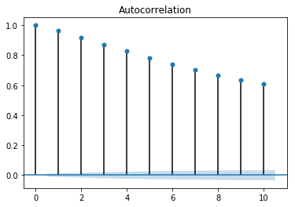
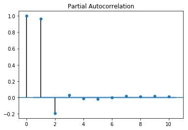
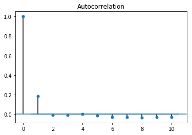
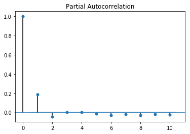
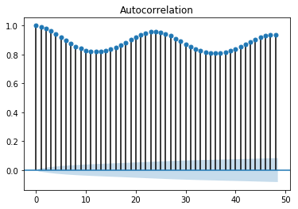
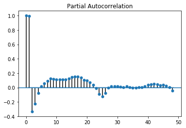
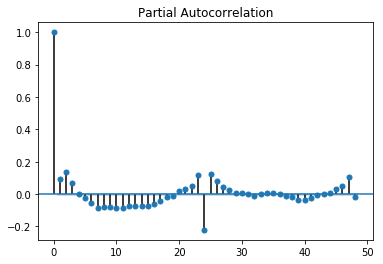

# Correctly Diagnosing a Time Series

When attempting to determine the best time series model, there are two pathways taht we can take to find the optimal parameters. The first option is to use information criteria (AIC, BIC, etc.) to select a model with acceptable parameters. These criteria tend to be blindly fit to the data, and do not allow us to bring any sort of business understanding to bear in combination to statistical techniques. 

For this reason, I strongly prefer the second method of creating ARIMA models: visual diagnosis. When we diagnose a model visually, we are able to use information resulting from the data to inform our decision. More importantly, we retain the ability to actively incorporate our understanding of the data itself into our choice. As practitioners, this is critical! The most important task that a data analyst has is to incorporate an understanding of the data into the choices made when optimizing a model for forecasting or prediction.

Do NOT be a data scientist who ignores the domain in which the data exists!

## The Autocorrelation Function (ACF)

When we create our model specification, we will use various visual characteristics of our data to determine the correct specification of the model. The first of these is the Autocorrelation Function (ACF). First things first, let's plot an ACF:


```python
import pandas as pd
from statsmodels.graphics.tsaplots import plot_acf

data = pd.read_csv("https://github.com/dustywhite7/Econ8310/blob/master/DataSets/pollutionBeijing.csv?raw=true").dropna()

fig = plot_acf(data['pm2.5'], lags=10)
fig.show()

```

    /opt/conda/lib/python3.7/site-packages/statsmodels/tools/_testing.py:19: FutureWarning: pandas.util.testing is deprecated. Use the functions in the public API at pandas.testing instead.
      import pandas.util.testing as tm





What does this graph tell us? An ACF plot shows us the average relationship between an observation and various lags of that same variable. In the figure above, we have specified that we want to only see the correlation between an observation and the first 10 lags of that variable. The figure shows very high correlation for the first lag, with slowly tapering correlation for each subsequent lagged period. 

When we see this type of pattern, it is an indication that there is an AR process at work in our time series. Our response to this figure should be to increase the AR order of our model (increase the $p$ parameter by one or more), to account for the autocorrelation within the time series.

If there were no autocorrelation, then we would expect to see very random movement from one lag to the next, or trivially small correlation coefficients (the values of the y-axis are correlation coefficients!). We will see this pattern below.

## The Partial Autocorrelation Function (PACF)

The Partial Autocorrelation Function (PACF) provides information analogous to our ACF regarding any MA properties that our time-series may present. It is also just as easy to implement:


```python
from statsmodels.graphics.tsaplots import plot_pacf

fig = plot_pacf(data['pm2.5'], lags=10)
fig.show()
```





In the above figure, you can see how quickly the plot fades toward zero. This is indicative of a lack of MA processes in our current time-series. If we had seen this figure for our ACF plot, then we would have assumed that there was no AR process in our model. Let's make a table describing possible patterns:

|&nbsp; | PACF | &nbsp; | 
| --- | --- | --- | 
| **ACF** |  Trails slowly to zero | Falls quickly to zero | &nbsp; |
| Trails slowly to zero | Both AR and MA <br>processes present | AR process only
| Falls quickly to zero | MA process only | Neither MA nor AR <br> process visible in data

## Checking for Integration

When checking for integration, we can use two methods: visual diagnosis or the Augmented Dickey-Fuller test. For visual diagnosis, we simply plot the variable of interest, and check whether or not there is a discernible pattern in the time-series. This is particularly easy in plotly, where we can quickly incorporate a trendline into our visual:


```python
import plotly.express as px

fig = px.scatter(data["pm2.5"], trendline='ols')
fig.show()
```

In this case, it is really hard to find the trendline (you'll get there if you slowly move your mouse around, though!). Once you find it, you'll see that the slope is -0.0001, which is basically 0 when you consider the scale moves from 0 to 1000. This appears to be a stationary time-series. Let's see if the statistical test agrees:


```python
from statsmodels.tsa.stattools import adfuller

adfuller(data['pm2.5'], maxlag=12)
```


    (-26.470868122329435,
     0.0,
     12,
     41744,
     {'1%': -3.430506662087084,
      '5%': -2.861609241123293,
      '10%': -2.5668068548124547},
     383188.6995163211)


According to its [documentation](https://www.statsmodels.org/dev/generated/statsmodels.tsa.stattools.adfuller.html), the first number is our test statistic, which clears the 1% threshold displayed below it. The null hypothesis is that there is a unit root in our time-series (meaning it is non-stationary). 

We can clearly reject the null hypothesis based on our test statistic, suggesting that our data is in fact stationary. This means that we reach the same conclusion through both visual and statistical diagnosis.

## Checking our model diagnosis

Now that we believe that our model is stationary ($d=0$), has an AR process ($p\geq1$), and has no MA process ($q=0$), we should construct an ARIMA(1,0,0) model. 


```python
import statsmodels.api as sm

arima = sm.tsa.ARIMA(data['pm2.5'], order=(1, 0, 0)).fit()
arima.summary()
```

    /opt/conda/lib/python3.7/site-packages/statsmodels/tsa/base/tsa_model.py:215: ValueWarning:
    
    An unsupported index was provided and will be ignored when e.g. forecasting.
    


<table class="simpletable">
<caption>ARMA Model Results</caption>
<tr>
  <th>Dep. Variable:</th>       <td>pm2.5</td>      <th>  No. Observations:  </th>    <td>41757</td>   
</tr>
<tr>
  <th>Model:</th>            <td>ARMA(1, 0)</td>    <th>  Log Likelihood     </th> <td>-192487.230</td>
</tr>
<tr>
  <th>Method:</th>             <td>css-mle</td>     <th>  S.D. of innovations</th>   <td>24.306</td>   
</tr>
<tr>
  <th>Date:</th>          <td>Wed, 25 Aug 2021</td> <th>  AIC                </th> <td>384980.461</td> 
</tr>
<tr>
  <th>Time:</th>              <td>19:43:18</td>     <th>  BIC                </th> <td>385006.379</td> 
</tr>
<tr>
  <th>Sample:</th>                <td>0</td>        <th>  HQIC               </th> <td>384988.648</td> 
</tr>
<tr>
  <th></th>                       <td> </td>        <th>                     </th>      <td> </td>     
</tr>
</table>
<table class="simpletable">
<tr>
       <td></td>          <th>coef</th>     <th>std err</th>      <th>z</th>      <th>P>|z|</th>  <th>[0.025</th>    <th>0.975]</th>  
</tr>
<tr>
  <th>const</th>       <td>   98.5731</td> <td>    3.348</td> <td>   29.442</td> <td> 0.000</td> <td>   92.011</td> <td>  105.135</td>
</tr>
<tr>
  <th>ar.L1.pm2.5</th> <td>    0.9645</td> <td>    0.001</td> <td>  746.634</td> <td> 0.000</td> <td>    0.962</td> <td>    0.967</td>
</tr>
</table>
<table class="simpletable">
<caption>Roots</caption>
<tr>
    <td></td>   <th>            Real</th>  <th>         Imaginary</th> <th>         Modulus</th>  <th>        Frequency</th>
</tr>
<tr>
  <th>AR.1</th> <td>           1.0368</td> <td>          +0.0000j</td> <td>           1.0368</td> <td>           0.0000</td>
</tr>
</table>


With a fitted model, we now want to check whether or not we still see signs of AR or MA processes (we shouldn't see any integration at this stage, and we should only have to deal with it before constructing our model). The way we make this check is through the **Residual ACF** and the **Residual PACF**. These plots serve to check for the same patterns as before, but are calculated based on the model residuals rather than on the original time series.


```python
# First, the residual ACF

fig = plot_acf(arima.resid, lags=10)
fig.show()
```





```python
# Now the residual PACF

fig = plot_pacf(arima.resid, lags=10)
fig.show()
```





Sometimes, we will see that we need to add additional AR or MA processes to our model. This would be observed through persisting correlation between one residual and its lags in the ACF or PACF, respectively. In this case, our model seems to contain all of the appropriate processes, and so we do not need to iterate further.

If we need to add AR or MA processes, we can add them one at a time, checking the residuals after each incrementation.

# ARIMA with Exogenous Variables (ARIMAX)

Congratulations! We can diagnose, build, and verify ARIMA models! Now we probably want to expand our model further in order to consider the influence of exogenous factors on our time-series. Very few time-series exist in a vacuum, so being able to use exogenous variables allows us to create a model that can accomodate our understanding that a time-series can be affected by many variables aside from just the past values of the time series itself.

It turns out that this is a very easy transition to make! In order to include exogenous variables, we simply need to include an additional parameter in our model.


```python
import patsy as pt

# Using Q() because pm2.5 is a terrible column name and needs to be put in quotes
# Also need to omit our intercept column
y, x = pt.dmatrices("Q('pm2.5') ~ -1 + TEMP + PRES + Iws", data=data)

# Now we just use y as our time-series, and the argument exog=x to include our exogenous regressors
arima = sm.tsa.ARIMA(y, order=(1, 0, 0), exog=x).fit()
arima.summary()
```


<table class="simpletable">
<caption>ARMA Model Results</caption>
<tr>
  <th>Dep. Variable:</th>    <td>Q('pm2.5')</td>    <th>  No. Observations:  </th>    <td>41757</td>   
</tr>
<tr>
  <th>Model:</th>            <td>ARMA(1, 0)</td>    <th>  Log Likelihood     </th> <td>-192329.990</td>
</tr>
<tr>
  <th>Method:</th>             <td>css-mle</td>     <th>  S.D. of innovations</th>   <td>24.215</td>   
</tr>
<tr>
  <th>Date:</th>          <td>Wed, 25 Aug 2021</td> <th>  AIC                </th> <td>384671.979</td> 
</tr>
<tr>
  <th>Time:</th>              <td>19:43:21</td>     <th>  BIC                </th> <td>384723.817</td> 
</tr>
<tr>
  <th>Sample:</th>                <td>0</td>        <th>  HQIC               </th> <td>384688.354</td> 
</tr>
<tr>
  <th></th>                       <td> </td>        <th>                     </th>      <td> </td>     
</tr>
</table>
<table class="simpletable">
<tr>
          <td></td>            <th>coef</th>     <th>std err</th>      <th>z</th>      <th>P>|z|</th>  <th>[0.025</th>    <th>0.975]</th>  
</tr>
<tr>
  <th>const</th>            <td> 1383.3711</td> <td>  156.784</td> <td>    8.823</td> <td> 0.000</td> <td> 1076.080</td> <td> 1690.662</td>
</tr>
<tr>
  <th>TEMP</th>             <td>   -1.2766</td> <td>    0.079</td> <td>  -16.071</td> <td> 0.000</td> <td>   -1.432</td> <td>   -1.121</td>
</tr>
<tr>
  <th>PRES</th>             <td>   -1.2474</td> <td>    0.154</td> <td>   -8.103</td> <td> 0.000</td> <td>   -1.549</td> <td>   -0.946</td>
</tr>
<tr>
  <th>Iws</th>              <td>   -0.0425</td> <td>    0.008</td> <td>   -5.606</td> <td> 0.000</td> <td>   -0.057</td> <td>   -0.028</td>
</tr>
<tr>
  <th>ar.L1.Q('pm2.5')</th> <td>    0.9630</td> <td>    0.001</td> <td>  728.835</td> <td> 0.000</td> <td>    0.960</td> <td>    0.966</td>
</tr>
</table>
<table class="simpletable">
<caption>Roots</caption>
<tr>
    <td></td>   <th>            Real</th>  <th>         Imaginary</th> <th>         Modulus</th>  <th>        Frequency</th>
</tr>
<tr>
  <th>AR.1</th> <td>           1.0384</td> <td>          +0.0000j</td> <td>           1.0384</td> <td>           0.0000</td>
</tr>
</table>


By simply passing the `exog` argument with an array of exogenous data, we can include our exogenous variables in our ARIMA model. This is possible because an ARIMA model is actually just an OLS model with some new parameters: lagged values of the dependent variable. Instead of being solved algebraically, it is solved as a maximum-likelihood problem, but in essence is no different than a special case of the MLE version of OLS!

# Seasonal ARIMA (SARIMA)

But wait, there's more! We can also incorporate seasonal effects into our models! 

Why would we want to do this? Many kinds time-series data (sales and temperature, to name a few) tend to fluctuate in predictable patterns. In order to better understand our data and to make forecasts, we want to account for these fluctuations as we build our model.

Let's try this with temperature data:


```python
px.line(data['TEMP'][-200:])
```


When we plot the temperature data, we can clearly see temperature cycles over each day. This isn't surprising, but it IS important when generating a model to be aware of these patterns. Let's look at our ACF and PACF over a 48-lag window:


```python
# First, the residual ACF

fig = plot_acf(data['TEMP'], lags=48)
fig.show()
```





```python
# Now the residual PACF

fig = plot_pacf(data['TEMP'], lags=48)
fig.show()
```





It's easy to see that the period 24 hours in the future has a stronger correlation with the current temperature than the periods in between. In order to accomodate this kind of information, we can implement a Seasonal ARIMA model (also called SARIMA). These models can be used with our without exogenous variables (just like ARIMA).

An SARIMA model has additional orders, and can be written as SARIMA$(p, d, q)(P, D, Q, S)$, where $P$ is the seasonal AR order, $D$ is the seasonal differencing order, $Q$ is the seasonal MA order, and $S$ represents the length in observations of one full cycle of seasons. In a daily temperature cycle, for example, $S$ would be 24. For monthly seasonality, $S$ would be 12 instead.

Let's try out our model, incorporating an AR process, as well as a seasonal AR process with a period of 24. We can then check our residual ACF and PACF to verify the model.


```python
sarima = sm.tsa.statespace.SARIMAX(data['TEMP'], order = (1,0,0), seasonal_order = (1,0,0,24)).fit()
sarima.summary()
```

    /opt/conda/lib/python3.7/site-packages/statsmodels/tsa/base/tsa_model.py:215: ValueWarning:
    
    An unsupported index was provided and will be ignored when e.g. forecasting.
    


<table class="simpletable">
<caption>Statespace Model Results</caption>
<tr>
  <th>Dep. Variable:</th>                <td>TEMP</td>              <th>  No. Observations:  </th>    <td>41757</td>  
</tr>
<tr>
  <th>Model:</th>           <td>SARIMAX(1, 0, 0)x(1, 0, 0, 24)</td> <th>  Log Likelihood     </th> <td>-72620.164</td>
</tr>
<tr>
  <th>Date:</th>                   <td>Wed, 25 Aug 2021</td>        <th>  AIC                </th> <td>145246.329</td>
</tr>
<tr>
  <th>Time:</th>                       <td>20:00:45</td>            <th>  BIC                </th> <td>145272.248</td>
</tr>
<tr>
  <th>Sample:</th>                         <td>0</td>               <th>  HQIC               </th> <td>145254.516</td>
</tr>
<tr>
  <th></th>                            <td> - 41757</td>            <th>                     </th>      <td> </td>    
</tr>
<tr>
  <th>Covariance Type:</th>               <td>opg</td>              <th>                     </th>      <td> </td>    
</tr>
</table>
<table class="simpletable">
<tr>
      <td></td>        <th>coef</th>     <th>std err</th>      <th>z</th>      <th>P>|z|</th>  <th>[0.025</th>    <th>0.975]</th>  
</tr>
<tr>
  <th>ar.L1</th>    <td>    0.9911</td> <td>    0.001</td> <td> 1427.448</td> <td> 0.000</td> <td>    0.990</td> <td>    0.992</td>
</tr>
<tr>
  <th>ar.S.L24</th> <td>    0.4182</td> <td>    0.003</td> <td>  120.323</td> <td> 0.000</td> <td>    0.411</td> <td>    0.425</td>
</tr>
<tr>
  <th>sigma2</th>   <td>    1.8967</td> <td>    0.008</td> <td>  251.869</td> <td> 0.000</td> <td>    1.882</td> <td>    1.911</td>
</tr>
</table>
<table class="simpletable">
<tr>
  <th>Ljung-Box (Q):</th>          <td>15769.39</td> <th>  Jarque-Bera (JB):  </th> <td>33622.76</td>
</tr>
<tr>
  <th>Prob(Q):</th>                  <td>0.00</td>   <th>  Prob(JB):          </th>   <td>0.00</td>  
</tr>
<tr>
  <th>Heteroskedasticity (H):</th>   <td>1.06</td>   <th>  Skew:              </th>   <td>-0.05</td> 
</tr>
<tr>
  <th>Prob(H) (two-sided):</th>      <td>0.00</td>   <th>  Kurtosis:          </th>   <td>7.39</td>  
</tr>
</table><br/><br/>Warnings:<br/>[1] Covariance matrix calculated using the outer product of gradients (complex-step).


And now our residual plots:


```python
# First, the residual ACF

fig = plot_acf(sarima.resid, lags=48)
fig.show()
```


```python
# Now the residual PACF

fig = plot_pacf(sarima.resid, lags=48)
fig.show()
```





Given the size of the correlations, our model is a borderline case now, but we will increment the order of $p$ first, and see if that makes a difference:


```python
sarima = sm.tsa.statespace.SARIMAX(data['TEMP'], order = (2,0,0), seasonal_order = (1,0,0,24)).fit()
sarima.summary()
```

    /opt/conda/lib/python3.7/site-packages/statsmodels/tsa/base/tsa_model.py:215: ValueWarning:
    
    An unsupported index was provided and will be ignored when e.g. forecasting.
    


<table class="simpletable">
<caption>Statespace Model Results</caption>
<tr>
  <th>Dep. Variable:</th>                <td>TEMP</td>              <th>  No. Observations:  </th>    <td>41757</td>  
</tr>
<tr>
  <th>Model:</th>           <td>SARIMAX(2, 0, 0)x(1, 0, 0, 24)</td> <th>  Log Likelihood     </th> <td>-72355.345</td>
</tr>
<tr>
  <th>Date:</th>                   <td>Wed, 25 Aug 2021</td>        <th>  AIC                </th> <td>144718.689</td>
</tr>
<tr>
  <th>Time:</th>                       <td>19:59:10</td>            <th>  BIC                </th> <td>144753.248</td>
</tr>
<tr>
  <th>Sample:</th>                         <td>0</td>               <th>  HQIC               </th> <td>144729.606</td>
</tr>
<tr>
  <th></th>                            <td> - 41757</td>            <th>                     </th>      <td> </td>    
</tr>
<tr>
  <th>Covariance Type:</th>               <td>opg</td>              <th>                     </th>      <td> </td>    
</tr>
</table>
<table class="simpletable">
<tr>
      <td></td>        <th>coef</th>     <th>std err</th>      <th>z</th>      <th>P>|z|</th>  <th>[0.025</th>    <th>0.975]</th>  
</tr>
<tr>
  <th>ar.L1</th>    <td>    1.1260</td> <td>    0.004</td> <td>  308.984</td> <td> 0.000</td> <td>    1.119</td> <td>    1.133</td>
</tr>
<tr>
  <th>ar.L2</th>    <td>   -0.1342</td> <td>    0.004</td> <td>  -37.330</td> <td> 0.000</td> <td>   -0.141</td> <td>   -0.127</td>
</tr>
<tr>
  <th>ar.S.L24</th> <td>    0.3496</td> <td>    0.004</td> <td>   94.301</td> <td> 0.000</td> <td>    0.342</td> <td>    0.357</td>
</tr>
<tr>
  <th>sigma2</th>   <td>    1.8729</td> <td>    0.007</td> <td>  254.598</td> <td> 0.000</td> <td>    1.858</td> <td>    1.887</td>
</tr>
</table>
<table class="simpletable">
<tr>
  <th>Ljung-Box (Q):</th>          <td>14430.59</td> <th>  Jarque-Bera (JB):  </th> <td>40517.88</td>
</tr>
<tr>
  <th>Prob(Q):</th>                  <td>0.00</td>   <th>  Prob(JB):          </th>   <td>0.00</td>  
</tr>
<tr>
  <th>Heteroskedasticity (H):</th>   <td>1.06</td>   <th>  Skew:              </th>   <td>-0.04</td> 
</tr>
<tr>
  <th>Prob(H) (two-sided):</th>      <td>0.00</td>   <th>  Kurtosis:          </th>   <td>7.83</td>  
</tr>
</table><br/><br/>Warnings:<br/>[1] Covariance matrix calculated using the outer product of gradients (complex-step).


Using this model to update the residual plots shows little if any progress in eliminating the remaining residual. We can also try changing $P$, the seasonal AR order:


```python
sarima = sm.tsa.statespace.SARIMAX(data['TEMP'], order = (1,0,0), seasonal_order = (2,0,0,24)).fit()
sarima.summary()
```


<table class="simpletable">
<caption>Statespace Model Results</caption>
<tr>
  <th>Dep. Variable:</th>                <td>TEMP</td>              <th>  No. Observations:  </th>    <td>41757</td>  
</tr>
<tr>
  <th>Model:</th>           <td>SARIMAX(1, 0, 0)x(2, 0, 0, 24)</td> <th>  Log Likelihood     </th> <td>-71235.965</td>
</tr>
<tr>
  <th>Date:</th>                   <td>Wed, 25 Aug 2021</td>        <th>  AIC                </th> <td>142479.930</td>
</tr>
<tr>
  <th>Time:</th>                       <td>20:05:05</td>            <th>  BIC                </th> <td>142514.488</td>
</tr>
<tr>
  <th>Sample:</th>                         <td>0</td>               <th>  HQIC               </th> <td>142490.846</td>
</tr>
<tr>
  <th></th>                            <td> - 41757</td>            <th>                     </th>      <td> </td>    
</tr>
<tr>
  <th>Covariance Type:</th>               <td>opg</td>              <th>                     </th>      <td> </td>    
</tr>
</table>
<table class="simpletable">
<tr>
      <td></td>        <th>coef</th>     <th>std err</th>      <th>z</th>      <th>P>|z|</th>  <th>[0.025</th>    <th>0.975]</th>  
</tr>
<tr>
  <th>ar.L1</th>    <td>    0.9856</td> <td>    0.001</td> <td> 1124.660</td> <td> 0.000</td> <td>    0.984</td> <td>    0.987</td>
</tr>
<tr>
  <th>ar.S.L24</th> <td>    0.3179</td> <td>    0.004</td> <td>   84.117</td> <td> 0.000</td> <td>    0.311</td> <td>    0.325</td>
</tr>
<tr>
  <th>ar.S.L48</th> <td>    0.2562</td> <td>    0.004</td> <td>   64.864</td> <td> 0.000</td> <td>    0.249</td> <td>    0.264</td>
</tr>
<tr>
  <th>sigma2</th>   <td>    1.7749</td> <td>    0.007</td> <td>  257.747</td> <td> 0.000</td> <td>    1.761</td> <td>    1.788</td>
</tr>
</table>
<table class="simpletable">
<tr>
  <th>Ljung-Box (Q):</th>          <td>7518.44</td> <th>  Jarque-Bera (JB):  </th> <td>39657.21</td>
</tr>
<tr>
  <th>Prob(Q):</th>                 <td>0.00</td>   <th>  Prob(JB):          </th>   <td>0.00</td>  
</tr>
<tr>
  <th>Heteroskedasticity (H):</th>  <td>1.04</td>   <th>  Skew:              </th>   <td>-0.05</td> 
</tr>
<tr>
  <th>Prob(H) (two-sided):</th>     <td>0.01</td>   <th>  Kurtosis:          </th>   <td>7.77</td>  
</tr>
</table><br/><br/>Warnings:<br/>[1] Covariance matrix calculated using the outer product of gradients (complex-step).


When we do, we again see little difference. It appears that we have extracted about as much information as we can from our time-series, unless we have exogenous factors to include.

In order to include exogenous factors in our SARIMA model, we can again use the `exog` argument:


```python
# WARNING: This cell will NOT run quickly!

y, x = pt.dmatrices("TEMP ~ -1 + Iws + PRES", data=data)

sarima = sm.tsa.statespace.SARIMAX(y, order = (1,0,0), seasonal_order = (1,0,0,24), exog=x).fit()
sarima.summary()
```


<table class="simpletable">
<caption>Statespace Model Results</caption>
<tr>
  <th>Dep. Variable:</th>                  <td>y</td>               <th>  No. Observations:  </th>    <td>41757</td>  
</tr>
<tr>
  <th>Model:</th>           <td>SARIMAX(1, 0, 0)x(1, 0, 0, 24)</td> <th>  Log Likelihood     </th> <td>-72509.038</td>
</tr>
<tr>
  <th>Date:</th>                   <td>Wed, 25 Aug 2021</td>        <th>  AIC                </th> <td>145028.076</td>
</tr>
<tr>
  <th>Time:</th>                       <td>20:08:34</td>            <th>  BIC                </th> <td>145071.274</td>
</tr>
<tr>
  <th>Sample:</th>                         <td>0</td>               <th>  HQIC               </th> <td>145041.722</td>
</tr>
<tr>
  <th></th>                            <td> - 41757</td>            <th>                     </th>      <td> </td>    
</tr>
<tr>
  <th>Covariance Type:</th>               <td>opg</td>              <th>                     </th>      <td> </td>    
</tr>
</table>
<table class="simpletable">
<tr>
      <td></td>        <th>coef</th>     <th>std err</th>      <th>z</th>      <th>P>|z|</th>  <th>[0.025</th>    <th>0.975]</th>  
</tr>
<tr>
  <th>x1</th>       <td>    0.0042</td> <td>    0.000</td> <td>   14.232</td> <td> 0.000</td> <td>    0.004</td> <td>    0.005</td>
</tr>
<tr>
  <th>x2</th>       <td>    0.0106</td> <td>    0.001</td> <td>   15.818</td> <td> 0.000</td> <td>    0.009</td> <td>    0.012</td>
</tr>
<tr>
  <th>ar.L1</th>    <td>    0.9832</td> <td>    0.001</td> <td> 1087.273</td> <td> 0.000</td> <td>    0.981</td> <td>    0.985</td>
</tr>
<tr>
  <th>ar.S.L24</th> <td>    0.4221</td> <td>    0.004</td> <td>  120.563</td> <td> 0.000</td> <td>    0.415</td> <td>    0.429</td>
</tr>
<tr>
  <th>sigma2</th>   <td>    1.8867</td> <td>    0.008</td> <td>  246.687</td> <td> 0.000</td> <td>    1.872</td> <td>    1.902</td>
</tr>
</table>
<table class="simpletable">
<tr>
  <th>Ljung-Box (Q):</th>          <td>15042.93</td> <th>  Jarque-Bera (JB):  </th> <td>31996.55</td>
</tr>
<tr>
  <th>Prob(Q):</th>                  <td>0.00</td>   <th>  Prob(JB):          </th>   <td>0.00</td>  
</tr>
<tr>
  <th>Heteroskedasticity (H):</th>   <td>1.06</td>   <th>  Skew:              </th>   <td>-0.05</td> 
</tr>
<tr>
  <th>Prob(H) (two-sided):</th>      <td>0.00</td>   <th>  Kurtosis:          </th>   <td>7.29</td>  
</tr>
</table><br/><br/>Warnings:<br/>[1] Covariance matrix calculated using the outer product of gradients (complex-step).


**Reading Assignment:**

Think of two types of time-series data that you deal with regularly (in work or school). Explain why each data source would or would not contain seasonality, and what kind of seasonality they present if there is seasonality. Put your answer in the cell below:

