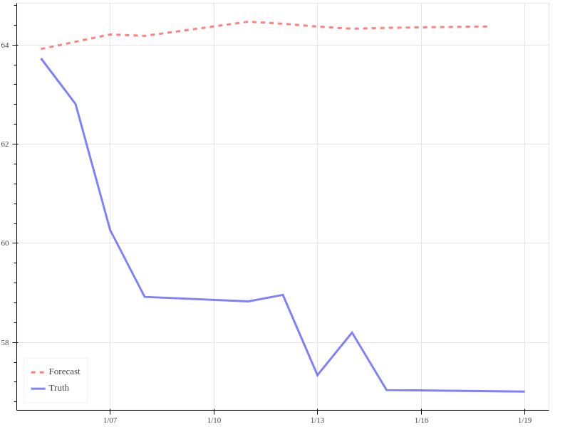
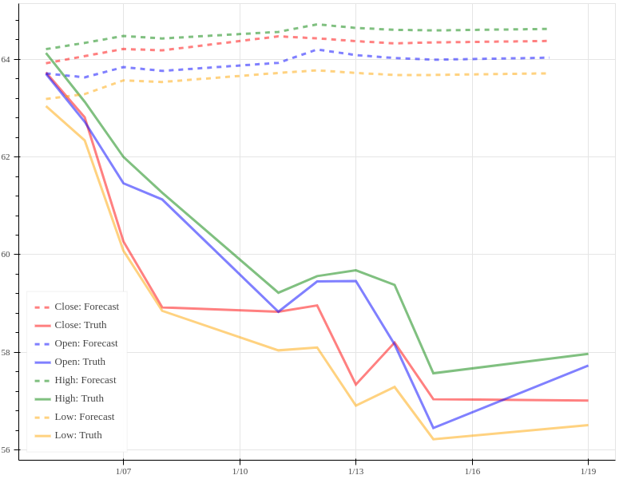

<!--
$theme: gaia
template: invert
-->


# Lecture 4: Time Series, VAR Models

---

### What is a VAR model?

VAR models are another way that we can model time series data.

- VAR: **V**ector **A**uto**R**egressive model
- Makes use of multiple correlated time series
- Based on SUR (Seemingly Unrelated Regressions) models

---

### Quick Overview of SUR models

<br>

Consider $j$ regression equations:

$$ Y_{j} = X_j\beta_j + \epsilon_j $$

where $Y_j$, and $\epsilon_j$ are $N \times 1$, $X_j$ is $N \times K$,  and $\beta_j$ is $K \times 1$


---

### Quick Overview of SUR models


Consider $j$ regression equations:

$$ Y_{j} = X_j\beta_j + \epsilon_j $$

Imagine that the outcomes $Y_{ij}$ are correlated such that 
$$ Cov(\epsilon_{ij}, \epsilon_{ik})=\sigma_{ij}$$
and 
$$ Cov(\epsilon_{ij}, \epsilon_{i'k})=0, \;\;\forall \;i \neq i'$$

---

### Quick Overview of SUR models

We can stack our regressions to get a single system of equations:

$$ \begin{bmatrix} y_1 \\ y_2 \\ \vdots \\ y_N\end{bmatrix} = \begin{bmatrix} X_1 & \mathbf{0} & ... & \mathbf{0}  \\ \mathbf{0} & X_1 & ... & \mathbf{0}  \\ \vdots & \vdots & \ddots & \mathbf{0} \\ \mathbf{0} & \mathbf{0} & \mathbf{0} & X_1  \end{bmatrix} \begin{bmatrix} \beta_1 \\ \beta_2 \\ \vdots \\ \beta_N\end{bmatrix} + \begin{bmatrix} \epsilon_1 \\ \epsilon_2 \\ \vdots \\ \epsilon_N\end{bmatrix}$$

---

### Quick Overview of SUR models

Then the FGLS estimator of the system is 

$$ \hat{\beta}_{FGLS} = \left( X'\left(\hat{\Sigma} \otimes I_N\right)X  \right)^{-1} X'\left(\hat{\Sigma} \otimes I_N\right)Y $$

<br>

Where $\hat{\Sigma} = [\hat{\sigma}_{ij}]$, and

$$ \hat{\sigma}_{ij} = \frac{1}{N}\left(y_i - X_i\beta_i\right)'\left(y_j - X_j\beta_j\right) $$


---

### Quick Overview of SUR models

So what does all this mean?
- SUR models relax the assumption that each regression is uncorrelated with the others
- Allows us to use one dependent variable in the $X$ matrix for another regression
	- This will in turn allow us to model simultaneous time series, where the errors across the series will certainly be correlated


---

### VAR Models

Just an SUR model where the multiple dependent variables are time series
- We can include lags of dependent variables as part of the $X$ matrix of covariates
- VAR models are built to capture the interactions between variables as time passes

---

### VAR Models

<br>

We can write the VAR model

$$ \mathbf{y}_t = \mathbf{\mu} + \mathbf{\Gamma}_1 \mathbf{y}_{t-1} + ... + \mathbf{\Gamma}_p \mathbf{y}_{t-p} + \mathbf{\epsilon}_t $$

Representing $m$ equations relating lagged dependent variables to the dependent variables in time $t$.

---

### Implementing a VAR Model

```python
# Getting started by importing modules and data

from __future__ import division , print_function 
import pandas as pd, numpy as np, patsy as pt
import matplotlib.pyplot as plt
from pandas_datareader.data import DataReader
from datetime import datetime

a = DataReader('JPM',  'yahoo', 
	datetime(2006,6,1), datetime(2016,6,1))
    
# Differencing observations to obtain stationary data

a_diff = pd.DataFrame(np.diff(a.values, axis=0), 
	index=a.index.values[1:], # re-applying index
    	columns=a.columns) # re-applying column names
```

---

### Implementing a VAR Model

```python
from statsmodels.tsa.api import VAR # import the model

model = VAR(a_diff) # define the model and data
model.select_order() # uses information criteria to select
		     # model order
reg = model.fit(5) # order chosen based on BIC criterion
```

- Diagnostics like those from the ARIMA(p,d,q) models are not available to determine our model order
- Use information criteria to find the optimal order of the VAR model
- Need to make our data stationary first

---

### Forecasting with a VAR Model

```python
sample = a_diff[:'2016-01-04'].values
fcast = reg.forecast(y = sample, steps = 10)
```

- When using a trained VAR model, we must include enough observations from our dataset in order to provide the expected number of lags to the model
- We have to begin our data $k$ observations prior to our end-point, where $k$ is the order of our model


---

### Forecasting with a VAR Model

```python
reg.plot_forecast(20) # will plot our forecast
```

- Recall that our forecast is not what we will observe in the real world
- We have **differenced** our data, and need to undo that differencing
- Apply our differenced forecasts to the most recent actual evaluation


---

### Forecasting with a VAR Model

```python
def dediff(end, forecast): # last ob, forecasts as input
    future = forecast
    for i in range(np.shape(forecast)[0]):
        if (i==0):
            future[i] = end + forecast[0]
        else:
            future[i] = future[i-1] + forecast[i]
            
    return future
```

- Use a function like this one to generate predicted values that can be applied to the original series


---

### Forecasting with a VAR Model

```python 
nextPer = pd.DataFrame(
		dediff(a['2016-01-04':'2016-01-04'], 
        	fcast),
            	pd.DatetimeIndex(start=datetime(2016,6,2),
                freq='D', periods=10),
                columns=a.columns)
rNext = a['2016-01-05':'2016-01-18']
```

Here, we generate our predictions and isolate the truth for the predicted periods

---

### Forecasting with a VAR Model

```python 
#Volume Plot
plt.figure(figsize=(12, 8))
plt.plot(nextPer['Volume'], '--', label='Forecast')
plt.plot(rNext['Volume'], '--', label='Truth')
plt.title('Volume Forecast')
plt.xticks(rotation=45)
plt.legend()
plt.show()
```

Plotting prediction vs truth in Volume

---

<!--
$theme: gaia
template: default
-->

### Forecasting with a VAR Model

<center>


</center>


---

### Forecasting with a VAR Model

<center>



</center>


---

### Forecasting with a VAR Model

<center>



</center>


---
<!--
$theme: gaia
template: invert
-->

### Forecasting Observations

<br>

- Repeated Forecasts are needed when data is updated
- Forecasts are not accurate far into the future


---

### Impulse Response Functions

<br>

- VAR Models can show us how each variable responds to a shock in our system
- Frequently used to determine impact of policy changes or economic shocks in Macro models
- Give us insight into how our VAR model perceives the relationship between parameters over time

---

### Impulse Response Functions

```python
irf = reg.irf(10) # 10-period Impulse Response Fn

irf.plot(impulse = 'Volume') # Plot volume change impact

irf.plot_cum_effects(impulse = 'Volume') # Plot cum effect
```

- Generate a 10-period Impulse Response Function (IRF)
- Focus on plotting the effect of changes in trade volume on all variables (over 10 periods)
- Plot the cumulative effect over 10 periods

---

<!--
$theme: gaia
template: default
-->

<center>


</center>

---

<!--
$theme: gaia
template: default
-->

<center>


</center>


---

<!--
$theme: gaia
template: invert
-->

### Saving Models

We can use ``` pickle``` functions to store our models to disk, and utilize them later.

```python
import cPickle as pkl

filename = '/your/directory/here' #string of file location
output = open(filename, 'wb') # allow python to write
pkl.dump(reg, output) # stores the reg object @ filename
output.close() # terminate write process
```

In this way, we can store just about any object in Python, although we have to take care with how large some objects may be.

---

### Restoring Models

<br>

```python
reg = pkl.load(open('yourfile.pkl', 'rb'))
```

When you are ready to access your model or data again, you can load your pickle back into memory.

- Forecast from same model on different days
- Share models with co-workers


---

### For lab today:

Working with your group, use 10 years of data (start on Jan 1, 2007, and end on Jan 1, 2017) on a stock of your choice to:
- Fit a VAR model (use stationary data!)
- Forecast 5 periods into the future, and send me your forecast
- Create a plot using the last 20 periods of in-sample data, and your 5-period forecast
- Fit and Compare an ARIMA model to your VAR model