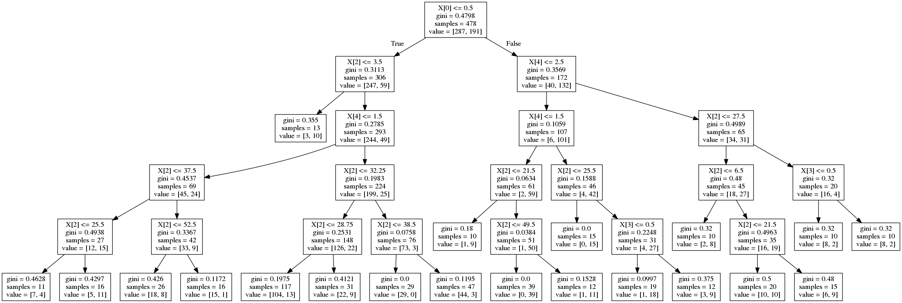

<!--
$theme: gaia
template: invert
-->


# Days 6 & 7: Entropy and Decision Trees

---

### What is Entropy?

**Entropy** is a measure of uncertainty (or information) about the world, or, more specifically, uncertainty about the true value of an outcome in a given model.

<br>

Lower entropy: less uncertainty

Higher entropy: greater uncertainty

---


### Measuring Entropy

Entropy can be calculated using the following equation

$$ H(x) = -\sum_{i=0}^n p(x_i)\;ln\;p(x_i) $$

This is *Nat* Entropy (Shannon entropy is calculated using $log_2$, and Hartley entropy uses $log_{10}$)


---


### Measuring Entropy

1) More options leads to higher entropy
2) Equal probabilities of outcomes lead to higher entropy


The goal of all of our predictive measures will be to reduce entropy (or maximize information gain) at each step in our model

**Remember:** information gain should be relative to the universe, not our sample

---


### Exercise

Write a function to estimate the Nat Entropy of a set of outcomes, given the observed probability for each outcome

1) If the probability of 5 outcomes are .2, .3, .1, .1, and .3, then what is the entropy of the system?
2) If the probabilty of each of 5 outcomes is .2, then what is the entropy of the system? 
3) If the probability of each of 10 outcomes is .1, then what is the entropy of the system?


---

### Exercise Answer

```python
import numpy as np

def natEnt(listP):
    entropy = 0
    n = len(listP)
    for i in range(n):
        entropy += listP[i] * np.log(listP[i])
    entropy *= -1
    return entropy
    
print(natEnt([.2,.3,.1,.1,.3]))
print(natEnt([.2]*5))
print(natEnt([.1]*10))
```

---

### Using Entropy

We need to determine how we can reduce the entropy of our system by dividing data.
1) Choose the most informative Variable
2) Choose how to best divide the selected variable in order to gain information
3) Repeat until we reach a stopping point
	- We need to predetermine a stopping rule


---

### Using Entropy

In order to choose the most informative variable, we need to first determine how informative each variable is

- Search across each variable for the optimal decision point
- Determine the information gain from that variable and decision point
- Compare the information gain across the available variables


---

### Information Gain

We can define information gain from a binary split of our data as follows:

$$ IG = H_0(x) - H_1(x) $$

Where $H_0$ is the original entropy, and $H_1$ is the entropy after the split.


---

### Information Gain

We can calculate $H_1$ as

$$H_1(x) = \omega_1 \cdot H_{11}(x) + \omega_2 \cdot H_{12}(x)$$

- $\omega_1$ and $\omega_2$: the ratio of elements in each respective child node relative to the parent node
- $H_{11}$ and $H_{12}$: the entropy of each child node


---

### Where is the Cutoff?

Where do we draw the line when dividing observations based on a given variable?

<br>
<center>


</center>


---

### Where is the Cutoff?

We need an algorithm that will **search** across possible cutoffs for our variable, and return the most advantageous split.

- Gradient Descent is frequently used on continuous variables
- For binary variables, we simply separate the groups
- For multi-class variables, determine which class can be separated to generate the greatest gain


---

### Concept Code


```python
# Determine the number of classes in dep. var, 
#       and calculate the probability of each
    
def prob(depVar):
    vals = np.unique(depVar)
    k = len(vals)
    n = len(depVar)
    counts = [0]*k
    for i in range(n):
        for j in range(k):
            if (depVar[i]==vals[j]):
                counts[j]+=1
    for i in range(k):
        counts[i] /= n
    return counts
```


---

### Concept Code


```python
def searchFn(y, x):
    minx = np.min(x)
    maxx = np.max(x)
    base = natEnt(prob(y))
    ent = [0]*len(y)
    bestx = minx
    gain = 0
    for i in np.linspace(minx, maxx, 
    		num=len(np.unique(y))):
        a = y[(x>=i)]
        b = y[(x<i)]
        if ((natEnt(prob(a)*len(a)) + 
        natEnt(prob(b))*len(b)) / len(y) < base):
            bestx = i
            gain = base - (natEnt(prob(a)*len(a)) + 
            	natEnt(prob(b))*len(b)) / len(y)
    return gain, bestx
```


---

### Concept Code


```python
# Determine the x variable that will most reduce entropy

def bestGain(y, x):
    base = natEnt(prob(y))
    best = [0,0,0,None]
    for i in range(np.shape(x)[1]):
        if (searchFn(y,x[:,i])[0] > best[0]):
            best = [searchFn(y,x[:,i])[0], 
            	searchFn(y,x[:,i])[1], i, None]
    return best
```


--- 

### Implementing a Decision Tree

We will start using the ```sklearn``` library today. It is the most robust machine learning library available, and allows us to implement many kinds of tests and algorithms. [sci-kit learn documentation](scikit-learn.org)

```python
from sklearn.tree import DecisionTreeClassifier
from sklearn.metrics import accuracy_score
from sklearn.model_selection import train_test_split
```

This is all the extra code that we will need to start using our new Decision Tree Classifiers.


---

### Fitting Data with Sci-kit Learn

<br>

```python
# Our import statements for this problem
import pandas as pd
import numpy as npi
import patsy as pt

from sklearn.tree import DecisionTreeClassifier
from sklearn.metrics import accuracy_score
from sklearn.model_selection import train_test_split
```

---

### Fitting Data with Sci-kit Learn

```python
# The code to implement a decision tree
data = pd.read_csv(
	"/home/dusty/DatasetsDA/Titanic/train.csv")


model = DecisionTreeClassifier()

y, x = pt.dmatrices("Survived ~ -1 + Sex + Age 
		+ SibSp + Pclass", data=data)

x, xt, y, yt = train_test_split(x, y, 
		test_size=0.33, random_state=42)

res = model.fit(x,y)

print("\n\nIn-sample accuracy: %s%%\n\n" 
 % str(round(100*accuracy_score(y, model.predict(x)), 2)))
```


---

### How does it do?

Using the Titanic dataset, and predicting survival with sex, age, siblings, and class (how fancy the passenger was traveling) results in the following printout: 

==In-sample accuracy: 94.35%==

For being easy to implement, that is a pretty good prediction!


---

### Visualizing the Model
<br>

- Decision Tree is just one (possibly long) logical statement
- We can quickly present a diagram of it to non-experts
- Even better, they will be able to read and **understand** that model


---

### Visualizing the Model

<br>


<br>

Didn't you say that this would be **human** readable?


---

### Overfitting in Decision Trees

If we want a model to be readable for a human, we should probably try to keep the model simpler. This will also aid in out-of-sample prediction accuracy.

```python
print("\n\nOut-of-sample accuracy: %s%%\n\n"
%str(round(100*accuracy_score(yt, model.predict(xt)), 2)))
```

==Out-of-sample accuracy: 75.85%==

So we are doing much worse on our out-of-sample observations than we do in-sample

---

### Overfitting Decision Trees

Let's restrict our tree to only 5 levels, and see what happens. We only need to modify one line of our code:

```python
model = DecisionTreeClassifier(max_depth=5)
```

==In-sample accuracy: 86.82%==

==Out-of-sample accuracy: 77.12%==

By simplifying, we actually do **better** out of sample


---

### The Tree

<br>


<br>


---

### Overfitting Decision Trees

Let's make one more change, and restrict our tree to leaves with 10 or more observations:

```python
model = DecisionTreeClassifier(max_depth=5, 
	min_samples_leaf=10)
```

==In-sample accuracy: 84.52%==

==Out-of-sample accuracy: 78.39%==

Again, we simplify and do **better** out of sample!


---

### The Tree

<br>



It's small on the slide, but it is now a reasonably readable algorithm.


---


### Overfitting

<br>

**Overfitting** is when we allow our model to overemphasize the random variation between observations in our sample. This practice will lead to higher in-sample accuracy (frequently 100% accuracy), but reduce our accuracy out of sample.