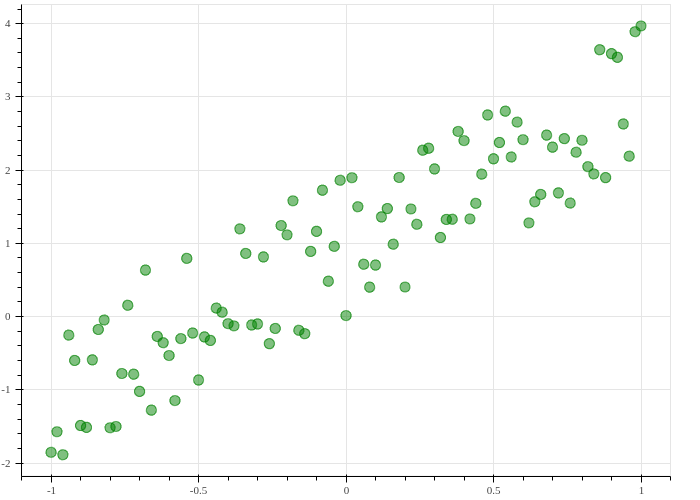
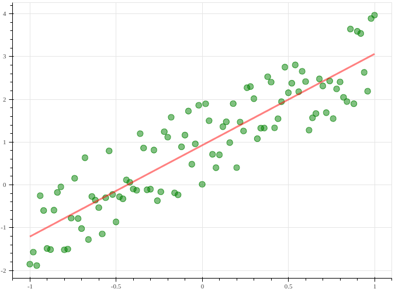
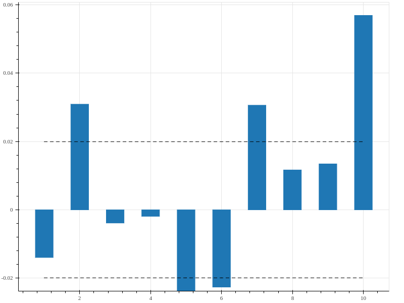
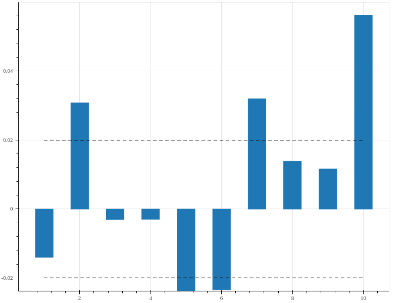
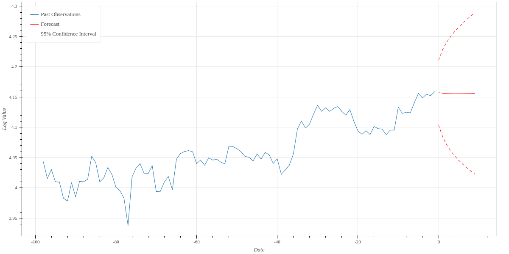

<!--
$theme: gaia
template: invert
-->

# ECON 8310
#### Business Forecasting

---

<br>

**Instructor**: 

Dustin White
Mammel Hall 332M

**Office Hours**:
TBA

**Contact Info**:
drwhite@unomaha.edu

---

### Grade Details

<center>

|Score|Grade|Score|Grade|
|:-:|:-:|:-:|:-:|
|\>94%|A|62.5-69.9|D
|90-93.9|A-|60-62.5|D-
|87.5-89.9|B+|\<60|F|
|82.5-87.4|B|
|80-82.4|B-|
|77.5-79.9|C+|
|72.5-77.4|C|
|70-72.4|C-|

</center>

---

### Grade Details

<br>
<center>

|Assignment|Percent of Grade|
|:-:|:-:|
|Lab Work|30%|
|Midterm Exam|10%|
|Final Exam|10%|
|Project 1| 25%|
|Project 2| 25%|

</center>

---

### My Expectations

- You will be expected to learn to program during this course if you do not already know how
- Plan on spending all of our time in lab working on projects and refining your predictions
- Take charge of your assignments; they will be open-ended

---

# Expectations of Me

- I will work through examples of code in class
- I will be available during office hours to help you with assignments
- I will be revise the course material as needed to suit your interests


---

# Day 1: Intro and OLS Review

---


### What is Forecasting?

Forecast: "to predict or estimate (a future event or trend)" -- Google Dictionary

- Predict stock market movements
- Estimate the quantity of stock required during a certain time-span
- Determine the most likely outcome of a stochastic process based on previous events
- **Learn from patterns**


---

### Quick Forecast

```python

import numpy as np
import matplotlib.pyplot as plt

x = np.linspace(-1, 1, 101)
y = 2 * (x + np.random.rand(101))

plt.plot(x, y)
plt.show()

```


---

### What just happened??
```python

import numpy as np
import matplotlib.pyplot as plt

```

These are our import statements

- We import "libraries" into Python that enable us to do tons of cool things
- In this case, we import numeric functions and the ability to render plots


---


### What just happened??

```python

x = np.linspace(-1, 1, 101)
y = 2 * (x + np.random.rand(101))

```

Next, we generate all our ==x== values, and our ==y== values (a random process based on those x values)

- There are 101 elements in both the ==x== and ==y== vectors


---


### What just happened??

```python

plt.plot(x, y)
plt.show()

```

Finally, we generate a series on our plot space using the ==x== and ==y== vectors as coordinates, and tell Python to show us the plot


---


**Should look like:**



---

### Quick Forecast

```python

xs = np.concatenate((np.ones(101).reshape(101,1),
		     x.reshape(101,1)), axis=1)
             
beta = np.linalg.solve(np.dot(xs.T, xs), np.dot(xs.T, y))

yhat = beta[0] + beta[1]*x

plt.plot(x, yhat)
plt.plot(x, y)
plt.show()


```

---

### Now What?

```python

xs = np.concatenate((np.ones(101).reshape(101,1),
		     x.reshape(101,1)), axis=1)

```

We create a matrix with a column of ones (to generate an intercept), and our ==x== values.


---

### Now What?

```python

beta = np.linalg.solve(np.dot(xs.T, xs), np.dot(xs.T, y))

```

Then we solve the equation
$$\hat{\beta}=(x'x)^{-1}x'y$$

- Note that we do NOT explicitly calculate the inverse of the $(x'x)$ matrix!


---

### Now What?

```python

yhat = beta[0] + beta[1]*x

plt.plot(x, yhat)
plt.plot(x, y)
plt.show()

```

And then we calculate our *estimate* of y using the first element (==beta[0]==) as an intercept, and the second element (==beta[1]==) as the slope of our function


---


**Now we see...**



---


### Our Goal

<br><br><br>
In this course, we want to learn how to predict outcomes based on the information that we already possess. 


---


### Forecasting

<br>

- Time Series forecasts
- Probility models
- Forecasting using machine learning
- Using ensemble methods to strengthen our understanding
- Choosing the best tool for the job


---


### Remembering OLS...

- Ordinary Least Squares (OLS) is the foundation of regression analysis, and an excellent starting point for this course
- Estimates the expected outcome ($\hat{y}$) given the inputs ($x$)


---


### Remembering OLS...

- Ordinary Least Squares (OLS) is the foundation of regression analysis, and an excellent starting point for this course
- Estimates the expected outcome ($\hat{y}$) given the inputs ($x$)
- Calculating coefficient standard errors informs us about the level of noise in the data
- $R^2$ and Adjusted $R^2$ tell us how much of the total variation our model accounts for


---


### Calculating the Least Squares Estimator


$$y = x\beta + \epsilon$$
$$\Downarrow$$
$$\epsilon = y - x\beta$$

So that we seek to minimize the squared error
$$min\;(y - x\beta)'(y - x\beta)$$


---


### Calculating the Least Squares Estimator


$$min_{\hat{\beta}}\;(y - x\beta)'(y - x\beta)$$
$$\Downarrow$$
$$ x'y = x'x\hat{\beta}$$
$$\Downarrow$$
$$\hat{\beta} = (x'x)^{-1}x'y$$


---


### Variance Estimators

Our unbiased estimate of the variance matrix is $\hat{s}^2$:

$$\hat{s}^2=\frac{(y-x\hat{\beta})'(y-x\hat{\beta})}{(n-k)}$$
or
$$\hat{s}^2=\frac{y'y-y'x(x'x)^{-1}x'y}{(n-k)}$$


---


### Covariance of $\hat{\beta}$

Under standard assumptions (specifically with normally distributed errors), 

$$\hat{\beta} \sim N(\beta, \sigma^2(x'x)^{-1})$$

Therefore, our estimate of the covariance of $\hat{\beta}$ is

$$ Cov(\hat{\beta}) = \hat{s}^2(x'x)^{-1}$$


---


### Calculating t-statistics and significance

The t-statistic of an OLS regression coefficient can be calculated as 

$$ t_j = \frac{\hat{\beta}_j}{\hat{\sigma}_j}$$

Where $\hat{\sigma}_j$ is the j-th element of the main diagonal of $Cov(\hat{\beta})$.


---


### Generating an OLS Results Table

We now have enough information to create a results table after performing OLS estimation:

|Coefficient|Std. Error|t-stat|P-value|
|:-:|:-:|:-:|:-:|
|$\hat{\beta}_j$|$\hat{\sigma}_j$|$t_j$|$P(\mid\hat{\beta}_j\mid>0\mid t_j)$
|...|...|...|...|


---


### Python and Distribution Functions


```python
import scipy.stats.t as tdist

pval = tdist.sf(tstat, df)
```

<br>

We use the ==sf== method of the t-distribution object to return 1-CDF of the t-distribution given our calculated t-statistic and our degrees of freedom $(n-k)$.


---


### Functions in Python

Sometimes, we want to make a prepackaged function to repeatedly generate results of a certain kind.

```python
def myFunction(input1, input2, ...):
    line1
    line2
    ...
    return results # can be one object, or a list of them
    
```


---


### Functions in Python

A simple example:

```python
def sayHello(n):
    for i in list(range(n_times)):
    	print("Hello!")
    
    return None
    
```

Will print "Hello!" ==n== times.


---


### Import Data


```python
import pandas as pd

# Read data from excel files
data = pd.read_excel("filename.xlsx")
    
# Read data from csv files    
data = pd.read_csv("filename.csv")
```

We use the ==pandas== library to import a table of data that we can use for calculations.


---


### Break apart Data


```python
import patsy as pt

# Create x and y matrices from a Data Frame

y, x = pt.dmatrices("y ~ x1 + x2 + ...", data=data)

```

We use the ==patsy== library to generate the ==x== and ==y== matrices that are necessary for OLS estimation


---


### Size of the Data

We can go back to ==numpy== to find the shape of our data (important for degrees of freedom calculations):

```python
import numpy as np

np.shape(data) # Returns (number_rows, number_columns)
```


---


### Getting Help


```python

help(pd.read_excel)

```

We use the ==help== function to get information about an object or function.

```python
dir(pd.read_excel)
```

The ==dir== function will allow you to view all methods associated with a given object or function.

---


### For lab today

Form a group (of 3-4 people). Work together to write a function that can take an arbitrary Data Frame (imported via ==pandas==), and print an OLS Regression table.

hint:
```python
def myOLS(data, regression_equation):
    ...
```

---


# Days 2 & 3: Time Series, ARIMA Models <br><font size="3">This lesson is based on material by [Robert Nau, Duke University](http://people.duke.edu/~rnau/forecasting.htm)</font>


---

### Time Series Data

<br>

A time series consists of repeated observations of a single variable, $y$, at various times, $t$.

$$\mathbf{y}=\{y_1, y_2, y_3, ..., y_t\}  $$

We seek to predict $y_{t+1}$ using the information from previous observations **y**.


---

### Time Series Data

In order to estimate $y_{t+1}$, we need to find the effect of previous observations of $y$ on the upcoming period. We might write this model as

<br>

$$ y_{t+1}=\alpha + \sum_{s=1}^t\beta_s\cdot y_s + \epsilon $$

---

### Time Series Data

If we choose to base our model solely on the previous period, then the model would be written

<br>

$$ y_{t+1}=\alpha + \beta_t \cdot y_t + \epsilon $$

<br>

Critically, OLS estimates of this model are invalid.

---

### Autocorrelation

One of the primary assumptions of the OLS model is that

$$Cov(\epsilon_t,\epsilon_s) = 0, \;\forall\; t \neq s $$

This assumption is clearly **not** valid in the case of time series data.

Let's look at some data to find out why.

---

### Autocorrelation

<br>


---

### Autocorrelation


We need to find a model that can eliminate the autocorrelation almost always seen in time series data.

---

### Autoregressive Models

AR models are based on the premise that  deviation from the underlying trend in the data persists in all future observations.

<br>

$$ y_{t} = \alpha + \sum_{i=1}^p \rho_i\cdot y_{t-i} + \epsilon_t $$


Where $\rho$ is the correlation term between periods and $\epsilon$ is an error (shock) term

---

### AR Models

- We need to consider lagged observations of $y$ in order to predict future outcomes
- The number of lags that we include is the **order** of our AR model
	- The model is an AR(p) Model, where p is the order of the model

---

### AR Models

- The AR coefficients tell us how quickly a model returns to its mean
	- If the coefficients on AR variables add up to close to 1, then the model reverts to its mean **slowly**
	- If the coefficients sum to near zero, then the model reverts to its mean **quickly**


---

### Integrated Models

Integration occurs when a process is non-stationary. A non-stationary process is one that contains a linear time trend. One example might be a long-term series of stock prices:


---

### Integrated Models

We need to ensure that our data is stationary. To do so, we need to remove the time-trend from the data.
- This is typically done through differencing

$$ y^s_i = y_i - y_{i-1} $$

where $y^s_t$ is the stationary time series based on the original series $y_t$


---

### Integrated Models

Here,  the time trend has been differenced out of the data from the previous plot


---

### Integrated Models

The Integration term $d$ represents the number of differencing operations performed on the data:
- I(1): $ y^s_t = y_t - y_{t-1} $
- I(2): $ y^s_t = (y_t - y_{t-1}) - (y_{t-1} - y_{t-2}) $

Where an I(2) model is analogous to a standard difference-in-differences model applied to time-series data.

---

### Moving Average Models

While an AR($\cdot$) model accounts for previous values of the dependent variable, MA($\cdot$) models account for previous values of the **error** terms:

$$ AR(p) = \alpha + \sum_{i=1}^p \rho_i\cdot y_{t-i} + \epsilon_t $$
$$ MA(q) = \alpha + \sum_{i=1}^q \theta_i\cdot \epsilon_{t-i} + \epsilon_t $$

---

### Moving Average Models

An MA model suggests that the current value of a time-series depends linearly on previous error terms.
- Current value depends on how far away from the underlying trend previous periods fell
- The larger $\theta$ becomes, the more persistent those error terms are

---

### Moving Average Models

- AR models' effects last infinitely far into the future
	- Each observation is dependent on the observation before
- In an MA model, the effect of previous periods only persists $q$ periods into the past
	- Each error is uncorrelated with previous errors


---

### Putting it Together

In order to account for all the problems that we might encounter in time series data, we can make use of ARIMA models.

**A**uto**R**egressive **I**ntegrated **M**oving **A**verage models allow us to
- Include lags of the dependent variable
- Take differences to eliminate trends
- Include lagged error terms


---

### Putting it Together

<br><br>

Even better, we can use ARIMA**X** models to include exogenous regressors in our estimations!

Now we just need to understand how to decide on the correct specifications for our model.


---

### The ARIMA(X) Model

ARIMA models are often referred to as 
ARIMA($p,d,q$) models, where $p$, $d$, and $q$ are the parameters denoting the order of the autoregressive terms, integration terms, and moving average terms, respectively.
- It is often a matter of guessing and checking to find the correct specification for a model
- We can use the ACF and PACF graphs to visually determine the order of our model


---

### The Autocorrelation Function (ACF)

The ACF illustrates the correlation between a dependent variable and its lags.
- Choose how many lags to explore (based on nature of data)
- **Reminder**: correlations will vary between -1 and 1, with 1 being perfect correlation, and -1 being perfect inverse correlation
- Correlation can be cyclical!

---

### The Autocorrelation Function (ACF)

<br>
<center>


</center>

---

### The Partial Autocorrelation Function

The PACF illustrates the correlation between a dependent variable and its lags, **after controlling for lower-order lags**.
- Choose how many lags to explore (based on nature of data)

---

### The Partial Autocorrelation Function (PACF)

<center>


</center>

---

### Building the Model

1. Make the series **stationary**
	- When the ACF falls "quickly" to zero at higher lags, the series is stationary
	- Can also use a **unit root test** to check for stationarity


---

### Building the Model

Nonstationary:


---

### Building the Model

Stationary:


---

### Building the Model

1. Make the series **stationary**
2. Use ACF and PACF plots to decide if you should include **AR** or **MA** terms in your model
	- Typically, we do not use both in the same model


---

### Building the Model

Signatures of **AR** and **MA** models:

<br>

**AR** Model: ACF dies out gradually, and the PACF cuts off sharply after a few lags

**MA** Model: ACF cuts off sharply, and PACF dies off more gradually (remember that **MA** models are based on previous *errors*)


---

### Building the Model

1. Make the series **stationary**
2. Use ACF and PACF plots to decide if you should include **AR** or **MA** terms in your model
3. Fit the model, and check residual ACF and PACF for lingering significance
4. If there are significant terms in residual ACF or PACF, add **AR** or **MA** terms, and try again


---

### ARIMA(X) in Python

```python
# Import pandas, numpy, and libraries for ARIMA models, 
#     for tools such as ACF and PACF functions, plotting,
#     and for using datetime formatting
import pandas as pd
import numpy as np
from statsmodels.tsa.arima_model import ARIMA
import statsmodels.tsa.stattools as st
import matplotlib.pyplot as plt
from datetime import datetime

# Import the pandas datareader function
from pandas_datareader.data import DataReader

# Collect data
a = DataReader('AAPL', 'yahoo', datetime(1990,6,1), 
		datetime(2016,6,1))
```

---

### ARIMA(X) in Python

```python
# Generate DataFrames from raw data
a_ts = pd.DataFrame(np.log(a['Adj Close'].values))
a_ts.index = a.index.values
a_ts.columns = ["Index"]
```

<br>

Here, we generate the time-series data that we will work with as we explore our ARIMA(X) models
- Take the logged price data, and put it into a separate DataFrame for analysis

---

### ARIMA(X) in Python
```python
# Plot the data
plt.figure(figsize=(15, 5)) # Create figure, set plot size
plt.ylabel("Log Value") # Give our y-axis a label
plt.plot(a_ts["Index"]) # Plot our time-series
plt.show() # Render the plot
```


---

### ARIMA(X) in Python

```python
# Generate plot from ACF
acf, aint=st.acf(a_ts, nlags=10, alpha=.05) # Calc ACF
plt.figure(figsize=(15,7)) # Create figure, set plot size
plt.stem(acf[1:]) # Specify plot type (stem) and data
plt.plot([1/np.sqrt(len(a_ts))]*10, 'k--') # Plot 95%
plt.plot([-1/np.sqrt(len(a_ts))]*10, 'k--') # Intervals
plt.title("ACF Plot") # Give plot a title
plt.show() # Render Plot
```

---

### ACF Plot


This is a clear indication that we do NOT have stationary data (yet)

---

### ARIMA(X) in Python

```python
# Generate plot from PACF
pacf, pint=st.pacf(a_ts, nlags=10, alpha=.05) # Calc PACF
plt.figure(figsize=(15,7)) # Create figure, set plot size
plt.stem(pacf[1:]) # Specify plot type (stem) and data
plt.plot([1/np.sqrt(len(a_ts))]*10, 'k--') # Plot 95%
plt.plot([-1/np.sqrt(len(a_ts))]*10, 'k--') # Intervals
plt.title("PACF Plot") # Give plot a title
plt.show() # Render Plot
``` 

---

### PACF Plot


---

### ARIMA(X) in Python

```python
# Plot first differences
plt.figure(figsize=(15, 5))
plt.ylabel("Returns")
plt.plot(np.diff(a_ts["Index"])[1:]) # plot differenced
plt.show()			     # log price series
```


---

### Differenced ACF Plot


This looks a lot more like white noise than the undifferenced ACF plot!

---

### Finding the Right Fit

- Time series models are unique in Econometrics: we need to **visually** diagnose the proper specifications for our model
	- This takes practice
	- This takes repetition and iteration for any given model


---

### Fitting the ARIMA(X) model

```python
from statsmodels.tsa.arima_model import ARIMA

model = ARIMA(a_ts, (1,1,1)) # Use a_ts data to fit an 
			     # ARIMA(1,1,1) model
reg = model.fit() # Fit the model using standard params
res = reg.resid # store the residuals as res
```

Once we fit the ARIMA model using our selected specification, we can then explore the residual ACF and PACF of the model.

---

### Fitting the ARIMA(X) model

Residual ACF (the text is dark)



---

### Fitting the ARIMA(X) model

Residual PACF (the text is dark) - nearly identical to the ACF plot (what does that mean?)




---

### Looking Ahead

Now that we have a fitted model, we can start to make predictions

```python
fcst = reg.forecast(steps=10) # Generate forecast
future = pd.DatetimeIndex(start=datetime(2016,6,2), 
			  freq='D', periods=10) # Index
predicted = pd.DataFrame(fcst[0], columns = ['Index'], 
			 index = future) # Map forecast
upper = fcst[2][:,1] # Specify upper 95% CI
lower = fcst[2][:,0] # Specify lower 95% CI
```

We make our out-of-sample forecast, and store it as a DataFrame, with dates as index values

---

### Looking Ahead

```python
plt.figure(figsize=(15,7))
plt.plot(a_ts[-100:]) # Start with last 100 obs from a_ts
plt.plot(predicted) # Plot our predicted values
# Fill the confidence interval with low opacity
plt.fill_between(x=future, y1 = lower, y2=upper, alpha=.2)
plt.show() # Render plot
```

We can then take a look at how our prediction follows the pattern from our time series

---

### Looking Ahead

The forecasted data is orange, and the confidence interval is pale blue.




---

### Finding the Right Fit

In order to more carefully choose the proper specification, we will actually select a preliminary model, and then investigate the **residual** ACF and PACF plots

- We can start with an ARIMA(0,1,0) model, or perhaps an ARIMA(1,0,0) model
- Base our starting point on the shape of our time series, or intuition about the data


---

### For lab today:

Working with your group, use the past 10 years of data (start on Jan 1, 2007, and end on Jan 1, 2017) on Costco Wholesale stock prices (ticker 'COST') to:
- Plot the data
- Make the data stationary
- Fit an ARIMA model
- Validate the model by plotting residuals
- Forecast 5 periods into the future, and send me your forecast

---

# Day 4: Time Series, VAR Models

---

### What is a VAR model?

VAR models are another way that we can model time series data.

- VAR: **V**ector **A**uto**R**egressive model
- Makes use of multiple correlated time series
- Based on SUR (Seemingly Unrelated Regressions) models

---

### Quick Overview of SUR models

<br>

Consider $j$ regression equations:

$$ Y_{j} = X_j\beta_j + \epsilon_j $$

where $Y_j$, and $\epsilon_j$ are $N \times 1$, $X_j$ is $N \times K$,  and $\beta_j$ is $K \times 1$


---

### Quick Overview of SUR models


Consider $j$ regression equations:

$$ Y_{j} = X_j\beta_j + \epsilon_j $$

Imagine that the outcomes $Y_{ij}$ are correlated such that 
$$ Cov(\epsilon_{ij}, \epsilon_{ik})=\sigma_{ij}$$
and 
$$ Cov(\epsilon_{ij}, \epsilon_{i'k})=0, \;\;\forall \;i \neq i'$$

---

### Quick Overview of SUR models

We can stack our regressions to get a single system of equations:

$$ \begin{bmatrix} y_1 \\ y_2 \\ \vdots \\ y_N\end{bmatrix} = \begin{bmatrix} X_1 & \mathbf{0} & ... & \mathbf{0}  \\ \mathbf{0} & X_1 & ... & \mathbf{0}  \\ \vdots & \vdots & \ddots & \mathbf{0} \\ \mathbf{0} & \mathbf{0} & \mathbf{0} & X_1  \end{bmatrix} \begin{bmatrix} \beta_1 \\ \beta_2 \\ \vdots \\ \beta_N\end{bmatrix} + \begin{bmatrix} \epsilon_1 \\ \epsilon_2 \\ \vdots \\ \epsilon_N\end{bmatrix}$$

---

### Quick Overview of SUR models

Then the FGLS estimator of the system is 

$$ \hat{\beta}_{FGLS} = \left( X'\left(\hat{\Sigma} \otimes I_N\right)X  \right)^{-1} X'\left(\hat{\Sigma} \otimes I_N\right)Y $$

<br>

Where $\hat{\Sigma} = [\hat{\sigma}_{ij}]$, and

$$ \hat{\sigma}_{ij} = \frac{1}{N}\left(y_i - X_i\beta_i\right)'\left(y_j - X_j\beta_j\right) $$


---

### Quick Overview of SUR models

So what does all this mean?
- SUR models relax the assumption that each regression is uncorrelated with the others
- Allows us to use one dependent variable in the $X$ matrix for another regression
	- This will in turn allow us to model simultaneous time series, where the errors across the series will certainly be correlated


---

# Day 5: Classification and Naive Bayes

---


# Days 6 & 7: Entropy, Histograms, and Decision Trees

---

# Day 8: Support Vector Machines

---

# Days 9 & 10: Ensemble Methods

---

# Day 11: Neural Networks?

---

# Day 12: Final Project, Making a Model