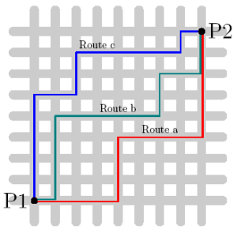

<!--
$theme: gaia
template: invert
-->


# Day 14: $k$-Nearest Neighbors

---

### How are homes appraised?

When a house is bought or sold, an appraiser typically evaluates the expected value of the home.

- Number of bedrooms
- House amenities
- Square footage
- Many other features...

The features of the marketed home are then compared to similar homes that have sold recently.

---

### What do we mean by similar?

How do we measure similarity?

We can measure it as a distance!

---

### How far is it?

How do we measure distance?
- City blocks
- "As the crow flies" (shortest line)
- Distance on a sphere (ie - shortest flight path)
- Travel time

---

### City Blocks

The measurement of distance by city blocks is frequently referred to as **manhattan distance**. 

$$ \text{Manhattan Distance} = \text{X Blocks} + \text{Y Blocks} $$

<center>



</center>

---

### Calculating Manhattan Distance

**Exercise**:

Given two points with n-dimensional coordinates, generate a function that will return the manhattan distance between those two points. 

Feel free to work with your group.

**Bonus**: Check to make sure that each vector representing a point has the same dimensionality.

---

### Exercise Answer

```python
import numpy as np

def manhattan(p1, p2):
    d = 0
    for i in range(len(p1)):
        d+=np.abs(p1[i]-p2[i])
    return d
```

Note that we need to use the absolute value, since negative distances in a given dimension must still be travelled in the same way as positive distances (no wormholes here).

---

### As the crow flies

This is the measurement that we most often think of as distance. It is referred to as **Euclidean distance**, and is calculated with the Pythagorean Equation. 

$$ \text{Euclidean Distance} = \sqrt{\sum_{i=1}^N(x_{i1}-x_{i2})^2} $$

In two dimensions:

$$  = \sqrt{(x_1 - x_2)^2 + (y_1 - y_2)^2} $$


---

### Calculating Euclidean Distance

**Exercise**:

Given two points with n-dimensional coordinates, generate a function that will return the euclidean distance between those two points. 

Feel free to work with your group.

---

### Exercise Answer

<br>

```python
import numpy as np

def euclidean(p1, p2):
    d = 0
    for i in range(len(p1)):
        d+=(p1[i]-p2[i])**2
    return np.sqrt(d)
```

---

### Nearest Neighbor

One way to make inference about a new, **unlabeled** observation is to compare it to the most similar (and labeled) observation.

- Do this using distance metrics!
- Find the observation with the smallest **distance**, and make inference about our new point

<center>

</center>

---

### $k$-Nearest Neighbors

What if there are a lot of similar observations? We can choose a number of comparisons to make! This algorithm is called **$k$-Nearest Neighbors**. If $k=1$, then we simply compare the single nearest observation.

- Increasing $k$ will decrease variance (overfitting), but may also increase bias

---

### Using $k$-Nearest Neighbors

**Step 1** - Collect all labeled data and store as "coordinates" of observations, with each label as the value at a given coordinate.
- We don't have to do ANY up-front calculations or modeling when we use $k$-Nearest Neighbors
- We have no way of knowing which stored observations will matter until we see the coordinates of the test observation

---

### Using $k$-Nearest Neighbors

**Step 2** - When you receive a test observation (or many), calculate the distance from **each** new observation to **every** stored observation.

**Step 3** - Sort the distances, and select the $k$ observations with the lowest distance value.

**Note**: The calculations that must be performed for every test observation are the same, and that the estimation is "computationally expensive."

---

### Using $k$-Nearest Neighbors

<br>

**Step 4** - Use some sort of (possibly weighted) average of the outcomes for the $k$ nearest neighbors of the new observation to determine the predicted label of the new observation.

---

### Using $k$-Nearest Neighbors

**Positives**:
- No up-front training necessary!
- Have control over how many observations affect prediction

**Negatives**:
- Very slow to generate a label, since all training must be done *after* observing test data
- Fitting must be done for **every** new observation

---

### kNN in Python

<br>

```python
# Import our typical libraries, and the kNN Classifier
import pandas as pd
import numpy as np
from sklearn.model_selection import train_test_split
from sklearn.neighbors import KNeighborsClassifier
from sklearn.metrics import accuracy_score

# Import our data, and separate our dependent variable
data = pd.read_csv("passFailTrain.csv")
y = data['G3']
x = data.drop(['Unnamed: 0','G3'], axis=1)
```

---

### kNN in Python

```python
# Create train and testing data
x, xt, y, yt = train_test_split(x, y, 
	test_size=0.1, random_state=42)
# Declare our classifier and its parameters
model = KNeighborsClassifier(n_neighbors=10, 
	metric='euclidean')
# 'Fit' the model to the data
reg = model.fit(x, y)
# Generate predicted labels for our test data
pred = reg.predict(xt)
# Calculate accuracy score
accuracy_score(pred, yt)
```
Produces an accuracy of 83.3%

---

### For Lab Today

With your team, use the poisonous mushrooms data to create a kNN model that will allow an avid mushroom picker to determine whether or not the mushroom they have picked is edible or poisonous.

- How does your model perform out-of-sample?
- How does it perform relative to other algorithms we have used? (Try a few to find out!)
- Is accuracy score the best measure on this data? (Might one kind of inaccuracy matter more than another?)