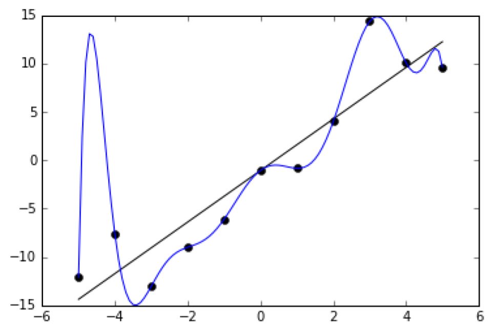
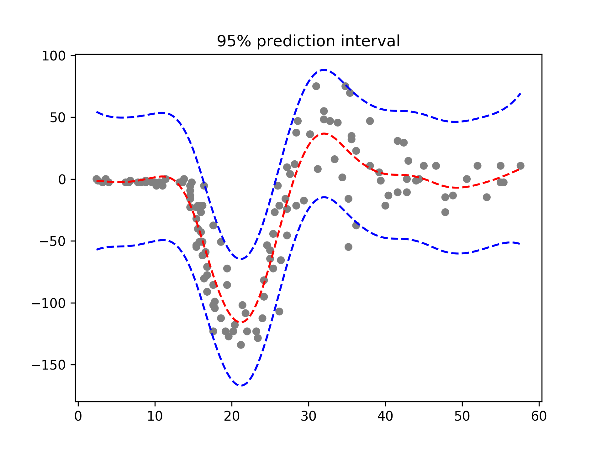
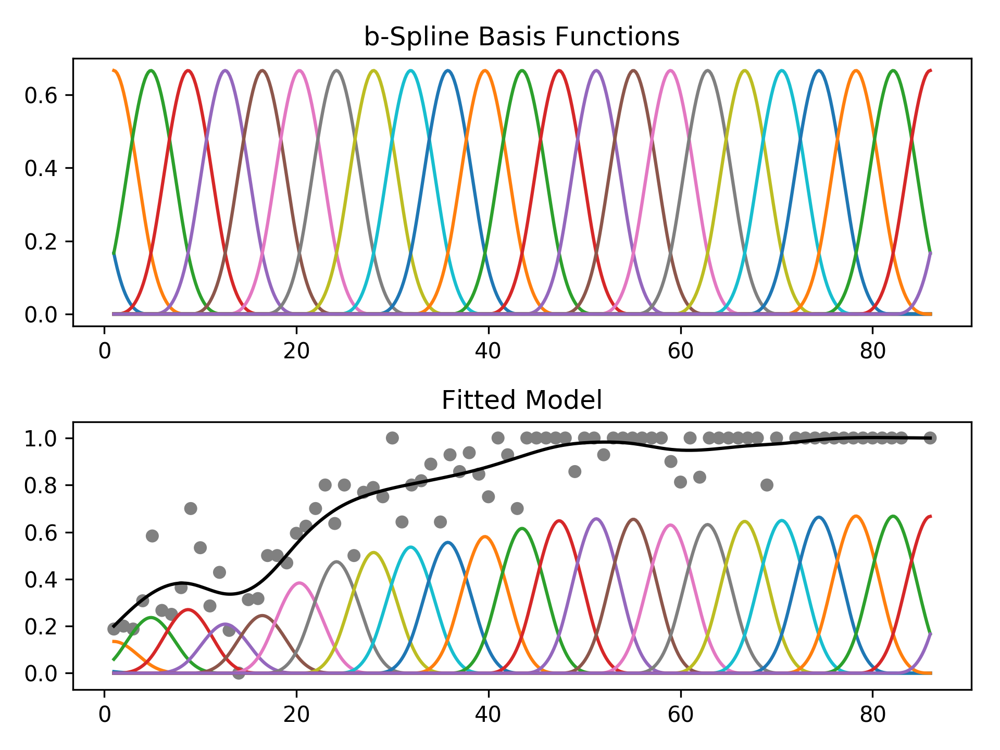
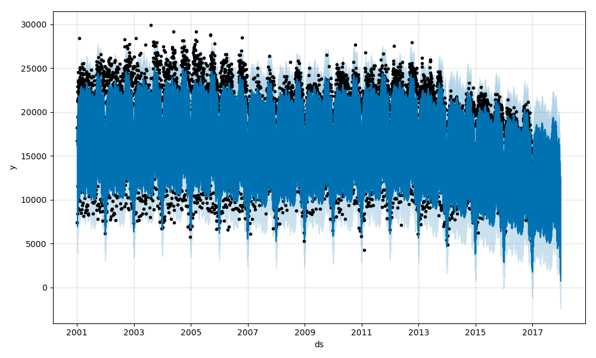
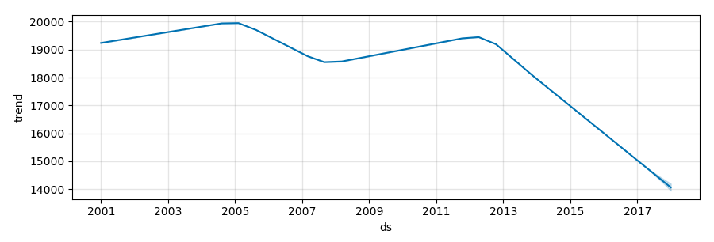
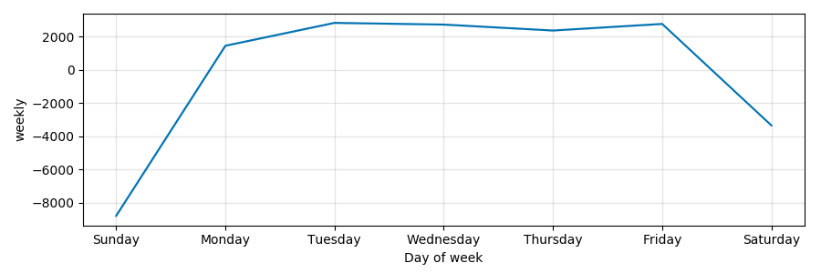
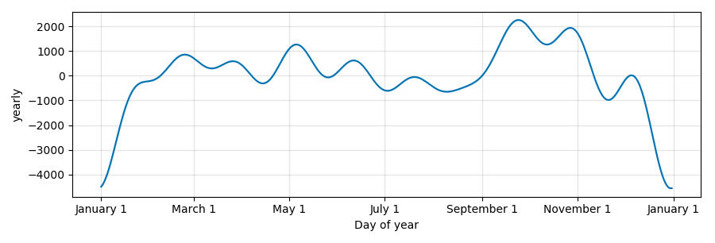
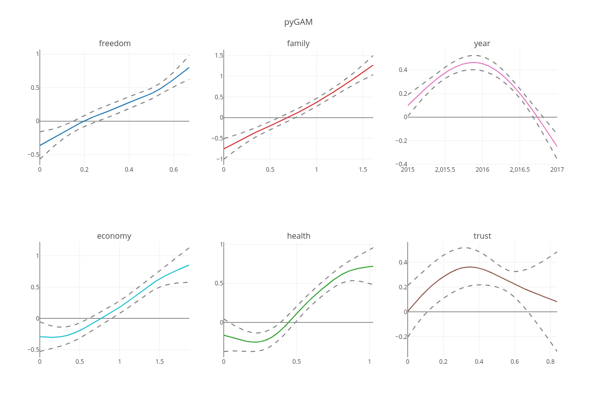

# Generalized Additive Models

---

# Linear and Nonlinear Models

**Linear Models (OLS and ARIMA)**
- Make strong assumptions about the relationships between dependent and independent variables
- But they are easily interpretable

**Non-linear Models**
- Reduce (or eliminate) these assumptions
- But this is often done at the cost of interpretability

---

# Non-linear Modeling

Non-linear models can be written generally as

$$ y = g(x) + \epsilon $$

where $g(\cdot)$ can be **any** function.

- Tremendous flexibility
- Low likelihood of interpretability


---

# Non-linear Modeling

If $g(\cdot)$ is a function of more than one parameter, interpretation may quickly become difficult. For example, if

$$ y = x_1^2x_2^2 + \epsilon $$

In this case, the marginal effect of $x_1$ on $y$ is

$$ \frac{\partial y}{\partial x_1} = 2x_1x_2^2 $$

and depends on the values of both $x_1$ and $x_2$.


---

# Generalized Additive Models

GAMs offer us much of the flexibility of non-linear models, without the difficulty of interpretation.
- Each parameter's effect on the dependent variable is modeled as its own function
- Since the model is additive, interpretation is straightforward, and parameter effects can be isolated

---

# Generalized Additive Models

GAMs allow us much of the flexibility of non-linear models, without the difficulty of interpretation.

$$ y = \sum_{i=1}^N f_i(x_i) + \epsilon $$

For two parameters, this could be expressed as

$$ y = f_1(x_1) + f_2(x_2) +  \epsilon $$

Marginal effects are still straightforward!

---

# Dangers of Overfitting



---

# Dangers of Overfitting

On the previous slide, a high-order polynomial was fitted to a parameter.
- Was the fit perfect? **Yes**
- Was it likely to fit the true data-generating process? **No**

---

# Non-linearity and Smoothness



---

# Non-linearity and Smoothness

This time, our high-order polynomial actually seems to represent the true relationship between the input and the output.
- Take care not to overfit your model
- Our true test will be when we fit a model, and use it to make predictions out-of-sample
- In sample, we can never do worse by applying a more complex functional form
- Out of sample, excess complexity can ruin our predictions

---

# GAM Fitting Procedure

If we want to fit an additive model, we need to create a loss function that we can optimize. For one parameter, we need to optimize

$$ y = a + f(x) + \epsilon $$

Sum of squared errors for this function is

$$ SSE = \sum_{i=1}^n (y_i - a - f(x_i))^2 $$


---

# Choosing GAM Smoothness

In addition to minimizing the SSE term, we need to include a term that will regulate how smooth our function is, penalizing our model for "less smooth" functional forms.

Our *Penalized* Sum of Squared Errors (PSSE) is

$$ \sum_{i=1}^n (y_i - a - f(x_i))^2 + \lambda \int_0^1 (f''(x))^2 dx $$

---

# Choosing GAM Smoothness

$\lambda$ is the parameter that we can adjust in order to choose how much we want to penalize our function for increased complexity.

$$ \int_0^1 (f''(x))^2 dx $$

The integral term takes into account how quickly the slope of our function is changing over the interval [0,1], and penalizes our SSE when this value is high.


---

# Fitting Functional Forms

In order to fit a GAM to the data, we need to be able to choose an arbitrary function from among infinite options.

**Splines** are a way for us to generate these functions without having to use computationally expensive searches through the function space (the group of possible function matches to the true function)

---

# Using Splines



---

# Implementing a GAM

We can use either of two libraries to implement our GAM models, depending on our specific needs:

- Time series models: prefer Facebook's `Prophet` library
- General predictive analytics: prefer `pyGAM` library


---

# Implementing a GAM in Prophet

```python
#Import statements
import pandas as pd
import numpy as np
from prophet import Prophet

# Prep the dataset
#   Make the data set a single line again!!
data = pd.read_csv(
    "https://github.com/dustywhite7/Econ8310/raw/master/
    DataSets/chicagoBusRiders.csv")

# Keep only the dates and the y value
route3 = data[data.route=='3'][['date','rides']]
# Format the date
route3.date = pd.to_datetime(route3.date, 
    infer_datetime_format=True)
# Recreate the data frame with correct labels
route3 = pd.DataFrame(route3.values, columns = ['ds','y'])
```

---

# Implementing a GAM in Prophet


---

# Implementing a GAM in Prophet

```python
# Initialize Prophet instance and fit to data

m = Prophet(changepoint_prior_scale=0.5)
# Higher prior values will tend toward overfitting
#     Lower values will tend toward underfitting

m.fit(route3)
```

In order to adapt the flexibility of our model, we are able to change the value of ```changepoint_prior_scale```. We can use this to make a more flexible or rigid model, depending on our needs. 

---


# Implementing a GAM in Prophet

<br>

```python
# Create timeline for 1 year in future, 
#   then generate predictions based on that timeline

future = m.make_future_dataframe(periods=365)
forecast = m.predict(future)
```

---


# Implementing a GAM in Prophet

```python
# Create plots of forecast and truth, 
#   as well as component breakdowns of the trends

plt = m.plot(forecast)
plt.savefig("prophet.png")

comp = m.plot_components(forecast)
comp.savefig("prophet_comp.png")
```


---

# Implementing a GAM in Prophet



---

# Implementing a GAM in Prophet

Yearly trend:



---

# Implementing a GAM in Prophet

Weekday trend:



---

# Implementing a GAM in Prophet

Day-of-year trend:



---

# Prophet Summary

Great if you only care about time variables. But what if you want to explore more than just $y$ regressed on $time$?

---

# Implementing a GAM in pyGAM

```python
from pygam import LinearGAM, s, f
import pandas as pd
import patsy as pt
import numpy as np
from plotly import tools
import plotly.offline as py
import plotly.graph_objs as go

# Prep the dataset
#   Put this back on one line!!
data = pd.read_csv(
    "https://github.com/dustywhite7/Econ8310/raw/master/
    DataSets/HappinessWorld.csv")
```

---

# Implementing a GAM in pyGAM

```python
# Generate x and y matrices
eqn = """happiness ~ -1 + freedom + family + 
      year + economy + health + trust"""
y,x = pt.dmatrices(eqn, data=data)

# Initialize and fit the model
gam = LinearGAM(s(0) + s(1) + s(2) + s(3) + s(4) + s(5))
gam = gam.gridsearch(np.asarray(x), y)
```

We create our `x` and `y` matrices using `patsy`, then we construct our GAM model.

---

# Implementing a GAM in pyGAM

```python
# Generate x and y matrices
eqn = """happiness ~ -1 + freedom + family + 
      year + economy + health + trust"""
y,x = pt.dmatrices(eqn, data=data)

# Initialize and fit the model
gam = LinearGAM(s(0) + s(1) + s(2) + s(3) + s(4) + s(5))
gam = gam.gridsearch(np.asarray(x), y)
```

The `LinearGAM` object requires a functional argument (`l`, `s` or `f`) for each variable in our data

Use `l` for linear functions, `s` for "spline-based" (or **s**mooth) functions of a variable, and `f` for "factor"-type variables (binary or step variables)

---

# Implementing a GAM in pyGAM


```python
# Specify plot titles and shape
titles = ['freedom', 'family', 'year', 'economy',
          'health', 'trust']

fig = tools.make_subplots(rows=2, cols=3, 
	subplot_titles=titles)
fig['layout'].update(height=800, width=1200, 
	title='pyGAM', showlegend=False)
```

To plot our marginal effects jointly, we need to create subplots, and assign a subplot to each of our variables.

Here, we prepare the canvas by creating the grid and shape of the overall figure.

---

# Implementing a GAM in pyGAM

```python
for i, title in enumerate(titles):
  XX = gam.generate_X_grid(term=i)
  pdep, confi = gam.partial_dependence(term=i, width=.95)
  trace = go.Scatter(x=XX[:,i], y=pdep, mode='lines', 
  	name='Effect')
  ci1 = go.Scatter(x = XX[:,i], y=confi[:,0], 
  	line=dict(dash='dash', color='grey'), 
    	name='95% CI')
  ci2 = go.Scatter(x = XX[:,i], y=confi[:,1], 
  	line=dict(dash='dash', color='grey'), 
    name='95% CI')
  ...
```

First, we iterate over each variable, creating the traces of the marginal effect and confidence interval

---

# Implementing a GAM in pyGAM


```python
for i, title in enumerate(titles):
  ...
  
  if i<3:
    fig.append_trace(trace, 1, i+1)
    fig.append_trace(ci1, 1, i+1)
    fig.append_trace(ci2, 1, i+1)
  else:
    fig.append_trace(trace, 2, i-2)
    fig.append_trace(ci1, 2, i-2)
    fig.append_trace(ci2, 2, i-2)
    
py.plot(fig)
```

Then we put the traces in their place on our grid, and plot the figure.

---

# Implementing a GAM in pyGAM



---

# Forecasting with pyGAM Models


```python
# Making a Forecast

# predicting the outcome of the UAE in 2015
gam.predict([[0.64, 1.13, 2015, 1.47, 0.81, 0.38]])
```

We need to provide a 2-dimensional array of parameters for generating forecasts (this is why there are double brackets `[[` and `]]`)

---

# Forecasting with pyGAM Models


```python
# Making a Forecast
# Read in new data or create a DataFrame containing new observations
dataNew = pd.DataFrame([[0.64, 1.13, 2015, 1.47, 0.81, 0.38]], 
columns = ['freedom', 'family', 'year', 'economy',
          'health', 'trust'])
          
# Align new data with the training data
xNew = pt.build_design_matrices([x.design_info], dataNew)

# predicting the outcome(s) from the test data
pred = gam.predict(xNew[0])
```

Our predicted happiness of 6.89 compares VERY favorably with the true value of 6.90

---

# Lab Time!