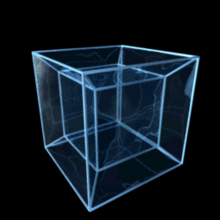
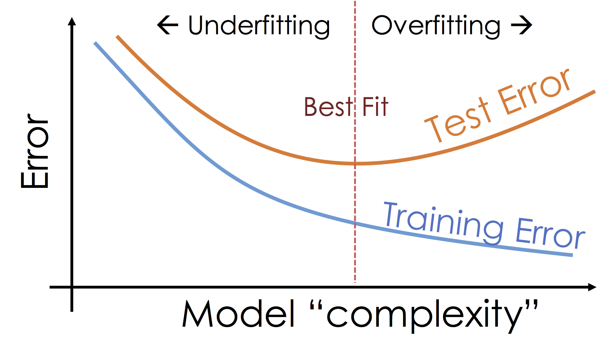

# Decision Trees
### Welcome to machine learning!

---

# Let's play 20 questions


<!-- ---

# They'll make your brain go

 -->

---

# Classifying with Histograms

Let's imagine that we want to classify observations based on a binary dependent variable, $y$.

- Two possible outcomes
- We classify each observation based on which outcome is most likely

$$ p(y|x) \geq .5 \Rightarrow \hat{y}=1 $$
$$ p(y|x) < .5 \Rightarrow \hat{y}=0 $$

---

# Classifying with Histograms

Let's draw some classifiers on the white board.
- Divide the data in half for each of two x variables
- Each separate bin can then be classified separately
- We can increase the granularity of our classifier by adding more breaks to each x variable

---

# Classifying with Histograms

Is there a more efficient way?
- Imagine we only divide variables in half
- How many discrete bins of data would exist if we looked at each of 16 variables in this way?


---

# Classifying with Histograms

Is there a more efficient way?
- Imagine we only divide variables in half
- How many discrete bins of data would exist if we looked at each of 16 variables in this way?
	- $2^{16} = 65,536$ possible bins
	- We would then need 65,536 observations at the **minimum** to obtain **any** information about each cell
- This is **not** efficient


<!-- --- 

### Classification - A Better Algorithm

If we don't want to use histograms, what tools are available?
- Logistic Regression
- Nearest Neighbor Algorithms
- Decision Trees
- Support Vector Machines
- Neural Networks (not in this course) -->


---

# Instead, we use Decision Trees

In effect, we will choose the **most useful** histograms to explore

---

# But first, we need to learn about entropy...

**Entropy** is a measure of uncertainty (or information) about the world, or, more specifically, uncertainty about the true value of an outcome in a given model.

<br>

Lower entropy: less uncertainty

Higher entropy: greater uncertainty

---


# Measuring Entropy

Entropy can be calculated using the following equation

$$ H(x) = -\sum_{i=0}^n p(x_i)\;ln\;p(x_i) $$

This is *Nat* Entropy (Shannon entropy is calculated using $log_2$, and Hartley entropy uses $log_{10}$, but it doesn't actually matter which we use so long as we are **consistent**)


---


# Measuring Entropy

1) More possible outcomes leads to higher entropy
2) Greater uncertainty among outcomes leads to higher entropy


The goal of all of our predictive measures will be to reduce entropy (or maximize information gain) at each step in our model

**Remember:** information gain should be relative to the universe, not our sample

---


# Exercise

Write a function to estimate the Nat Entropy of a set of outcomes, given the observed probability for each outcome in an arbitrary set. Use your function to answer:

1) If the probability of 5 outcomes are .2, .3, .1, .1, and .3, then what is the entropy of the system?
2) If the probabilty of each of 5 outcomes is .2, then what is the entropy of the system? 
3) If the probability of each of 10 outcomes is .1, then what is the entropy of the system?


---

# Exercise Answer

```python
import numpy as np

def natEnt(listP):
    entropy = 0
    n = len(listP)
    for i in range(n):
        entropy += listP[i] * np.log(listP[i])
    entropy *= -1
    return entropy
    
print(natEnt([.2,.3,.1,.1,.3]))
print(natEnt([.2]*5))
print(natEnt([.1]*10))
```

---

# Using Entropy

We need to determine how we can reduce the entropy of our system by dividing data.
1) Choose the most informative Variable
2) Choose how to best divide the selected variable in order to gain information
3) Repeat until we reach a stopping point
	- We need to predetermine a stopping rule


---

# Using Entropy

In order to choose the most informative variable, we need to first determine how informative each variable is

- Search across each variable for the optimal decision point
- Determine the information gain from that variable and decision point
- Compare the information gain across the available variables


---

# Information Gain

We can define information gain from a binary split of our data as follows:

$$ IG = H_0(x) - H_1(x) $$

Where $H_0$ is the original entropy, and $H_1$ is the entropy after the split.


---

# Information Gain

We can calculate $H_1$ as

$$H_1(x) = \omega_1 \cdot H_{11}(x) + \omega_2 \cdot H_{12}(x)$$

- $\omega_1$ and $\omega_2$: the fraction of elements in each respective child node relative to the parent node (should add up to 1)
- $H_{11}$ and $H_{12}$: the entropy of each child node


---

# Where is the Cutoff?

Where do we draw the line when dividing observations based on a given variable?

<br>


---

# Where is the Cutoff?

We need an algorithm that will **search** across possible cutoffs for our variable, and return the most advantageous split.

- Gradient Descent is frequently used on continuous variables
- For binary variables, we can simply separate the groups/classes
- For count variables, determine which cutoff will generate the greatest gain


<!---

### Concept Code


```python
# Determine the number of classes in dep. var, 
#       and calculate the probability of each
# NOTE: this is NOT efficient code
    
def prob(depVar):
    vals = np.unique(depVar)
    k = len(vals)
    n = len(depVar)
    probs = [0]*k
    for i in range(n):
        for j in range(k):
            if (depVar[i]==vals[j]):
                probs[j]+=(1/n)
    return probs
```


---

### Concept Code


```python
def searchFn(y, x):
    minx = np.min(x)
    maxx = np.max(x)
    base = sEnt(prob(y))
    ent = [0]*len(y)
    bestx = minx
    gain = 0
    for i in np.linspace(minx, maxx, 
    		num=len(np.unique(y))):
        a = y[(x>=i)]
        b = y[(x<i)]
        if ((sEnt(prob(a)*len(a)) + 
        sEnt(prob(b))*len(b)) / len(y) < base):
            bestx = i
            gain = base - (sEnt(prob(a)*len(a)) + 
            	sEnt(prob(b))*len(b)) / len(y)
    return gain, bestx
```


---

### Concept Code


```python
# Determine the x variable that will most reduce entropy

def bestGain(y, x):
    base = sEnt(prob(y))
    best = [0,0,0,None]
    for i in range(np.shape(x)[1]):
        if (searchFn(y,x[:,i])[0] > best[0]):
            best = [searchFn(y,x[:,i])[0], 
            	searchFn(y,x[:,i])[1], i, None]
    return best
```

Repeating these functions recursively until we reach our stopping rule would create a decision tree using our most informative variables.

--->
---

# Implementing a Decision Tree

We will be using the ```sklearn``` library today. It is the most robust machine learning library available, and allows us to implement many kinds of tests and algorithms. [sci-kit learn documentation](scikit-learn.org)

```python
from sklearn.tree import DecisionTreeClassifier
from sklearn.metrics import accuracy_score
from sklearn.model_selection import train_test_split
```

This is all the extra code that we will need to start using our new Decision Tree Classifiers.


---

# Fitting Data with Sci-kit Learn

<br>

```python
# Our import statements for this problem
import pandas as pd
import numpy as np
import patsy as pt

from sklearn.tree import DecisionTreeClassifier
from sklearn.metrics import accuracy_score
from sklearn.model_selection import train_test_split
```

---

# Fitting Data with Sci-kit Learn

```python
# The code to implement a decision tree
data = pd.read_csv(
	"https://github.com/dustywhite7/Econ8310/"
  + "raw/master/DataSets/titanic.csv")


model = DecisionTreeClassifier()

# As usual, Patsy makes data prep easier
y, x = pt.dmatrices("Survived ~ -1 + Sex + Age 
		+ SibSp + Pclass", data=data)

x, xt, y, yt = train_test_split(x, y, 
		test_size=0.33, random_state=42)

res = model.fit(x,y)

print("\n\nIn-sample accuracy: %s%%\n\n" 
 % str(round(100*accuracy_score(y, model.predict(x)), 2)))
```


---

# How does it do?

Using the Titanic dataset, and predicting survival with sex, age, siblings, and class (how fancy the passenger was traveling) results in the following printout: 

**In-sample accuracy: 94.35%**

For being easy to implement, that is a pretty good prediction!

---

# Visualizing the Model

<br>


<br>

Didn't you say that this would be **human** interpretable?

---

# Bias and Variance




---

# Bias and Variance

**Bias**: When we predict using a model, the bias is the difference between our predicted outcome and the true outcome

<br>

**Variance**: When we predict one observation using various models, the variance is the dispersion of outcomes for that single observation
- Do all models tend to say the same thing? That would indicate low variance

---

# Bias and Variance

Typically, both bias and variance can be reduced by training models on a larger data set. This is unsurprising, since more information about an outcome should enable us to make better decisions regarding that outcome

- These models are designed to converge on truth
- Assuming that we have **representative** data

---

# Bias and Variance

While more data is better for both, bias and variance are opposites when it comes to model complexity

- Bias declines as complexity increases
- Variance increases as complexity increases

Our job is to identify the sweet spot where the **combined** error is lowest

---

# Overfitting

<br>

**Overfitting** is when we allow our model to overemphasize the random variation between observations in our sample. This practice will lead to higher in-sample accuracy (frequently we will even achieve 100% accuracy in-sample!), but reduce our accuracy out of sample.

---

# Underfitting

<br>

**Underfitting** is when we fail to take advantage of available information, and induce higher errors both in- and out-of-sample

- If we don't make use of our data, then we can't make quality decisions


---

# Overfitting in Decision Trees

Remember our crazy decision tree? If we want a model to be readable for a human, we should probably try to keep the model simpler. This will also improve out-of-sample accuracy.

```python
print("\n\nIn-sample accuracy: %s%%\n\n" 
 % str(round(100*accuracy_score(y, model.predict(x)), 2)))
print("\n\nOut-of-sample accuracy: %s%%\n\n"
%str(round(100*accuracy_score(yt, model.predict(xt)), 2)))
```
**In-sample accuracy: 94.35%**
**Out-of-sample accuracy: 75.85%**

Performance is much worse out of sample

---

# Overfitting Decision Trees

Let's restrict our tree to only 5 levels, and see what happens. We only need to modify one line of our code:

```python
model = DecisionTreeClassifier(max_depth=5)
```

**In-sample accuracy: 86.82%**

**Out-of-sample accuracy: 77.12%**

By simplifying, we actually do **better** out of sample, even though training accuracy suffers!


---

# The Tree

<br>


<br>


---

# Overfitting Decision Trees

Let's make one more change, and restrict our tree to leaves with 10 or more observations:

```python
model = DecisionTreeClassifier(max_depth=5, 
	min_samples_leaf=10)
```

**In-sample accuracy: 84.52%**

**Out-of-sample accuracy: 78.39%**

Again, we simplify and do **better** out of sample!


---

# The Tree


It's small on the slide, but it is now a reasonably readable algorithm. At most, you have to ask 5 questions to arrive at an answer.


---

# Lab time!

<!-- ---

### In Lab Today

Using the assignment data, work to construct a Decision Tree to accurately predict which purchases will be meals. Use k-fold cross-validation or train/test splits as you train to determine the accuracy of your model. Submit your code on Mimir to test your final model out-of-sample.

- How deep is your ideal tree?

- How many samples should each leaf contain?

- How accurate can you actually make your model out of sample? -->
