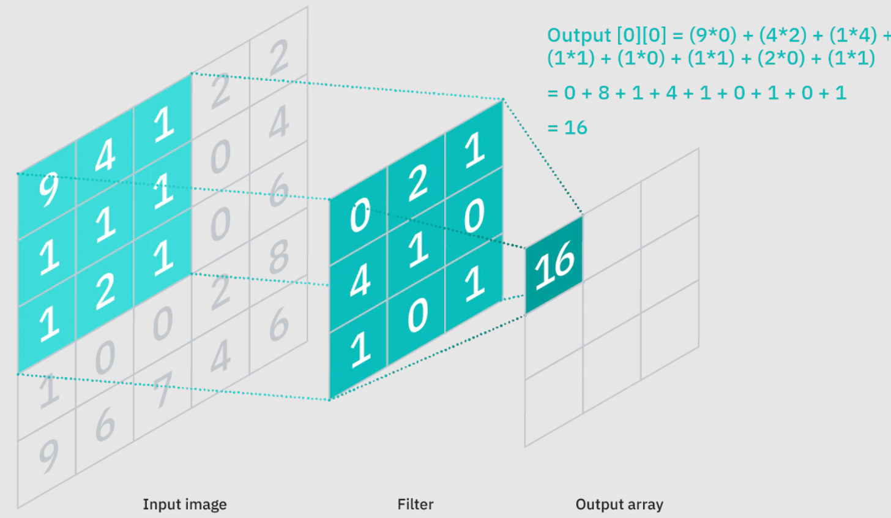

# Neural Networks

### For a great supplementary read, [check this out](https://writings.stephenwolfram.com/2023/02/what-is-chatgpt-doing-and-why-does-it-work/)!

---


---

# Why?

Neural networks are **advanced** machine learning models designed to replicate many observed characteristics of human brains
- Hard to use well
- Difficult to explain clearly
- Highly valuable **in specific contexts**

---

# The basics - Perceptrons

A perceptron is the computational equivalent of a single neuron

Let's describe it with a visual

---

# A perceptron


---

# What is an Activation Function?

An activation function is a math function that determines when a perceptron moves from "off" to "on".

Again, let's describe this visually

---


---

# How does this make a Neural Network?

Neural networks are made up of **layers** of perceptrons that are interconnected, leading from the **input layer** to the **output layer**.

Any layer in between is called a **hidden layer**. Neural networks are often referred to as **deep learning** because of these hidden layers making the nerual network "deep".

---


---

# How do we use them?

Our goal with a neural network is to train our network with **weights** and **biases** (these are what trigger the activation functions, remember?) so that the network is able to represent the complex process of predicting our outcome of interest.

---

# How we learn - Backpropagation


---

# How we learn - Backpropagation

Through inputs and backpropagation, we train our model to perform as well as we can on our task.

How do we choose the right network?

---

# Choosing the right network

1. Use one that someone else designed for the same (or similar) tasks
2. Evolutionary algorithms ("neuroevolution")
    - Here's an example: https://www.youtube.com/watch?v=qv6UVOQ0F44
3. Trial and error (probably not efficient)

---

# Using Keras to work with Neural Networks

This simple example comes from the [keras documentation](https://keras.io/examples/vision/mnist_convnet/)

```python
import numpy as np
from tensorflow import keras
from tensorflow.keras import layers
```

---

# Prep and Load Data

```python
# Model / data parameters
num_classes = 10
input_shape = (28, 28, 1)

# Load the data and split it between train and test sets
(x_train, y_train), (x_test, y_test) = keras.datasets.mnist.load_data()
```

It's better for this example to pull MNIST from the library, since it is already stored on Google's server so it loads the FULL 60,000 observations very quickly

---

# Scale Image Data

```python
# Scale images to the [0, 1] range
x_train = x_train.astype("float32") / 255
x_test = x_test.astype("float32") / 255
```

Many small images come with data stored in levels from 0 to 255 (8-bits), and we need to scale that to be between 0 and 1

---

# Color channels

```python
# Make sure images have shape (28, 28, 1)
x_train = np.expand_dims(x_train, -1)
x_test = np.expand_dims(x_test, -1)
print("x_train shape:", x_train.shape)
print(x_train.shape[0], "train samples")
print(x_test.shape[0], "test samples")
```

Many images have 3 color channels, so our data needs to have three dimensions (height, width, color channels). Since this data is black and white, we only have one channel.

---

# Convert dependent variable

```python
# convert class vectors to binary class matrices - one hot encoding
y_train = keras.utils.to_categorical(y_train, num_classes)
y_test = keras.utils.to_categorical(y_test, num_classes)
```

Instead of 1 column with values between 0 and 9, we need 10 columns, with ones and zeros, called **one hot encoding**, just like what we did for regressions with categorical data.

---

# Specify the model

```python
model = keras.Sequential(
    [
        keras.Input(shape=input_shape),
        layers.Conv2D(32, kernel_size=(3, 3), activation="relu"),
        layers.MaxPooling2D(pool_size=(2, 2)),
        layers.Conv2D(64, kernel_size=(3, 3), activation="relu"),
        layers.MaxPooling2D(pool_size=(2, 2)),
        layers.Flatten(),
        layers.Dropout(0.5),
        layers.Dense(num_classes, activation="softmax"),
    ]
)

model.summary()
```


---

# Convolution



---

# Convolution

The goal of convolution is to try to extract patterns in our image through small-scale filters applied to each region of the image. This reduces the size of the image, but the result is a matrix of "pattern" data.

---

# Pooling


---

# Pooling

Pooling is a simple compression of the data, with our options being to average the value of a group of pixels, or to take the maximum value of the grouped pixels

---

# Dropout


---

# Dropout

In a neural network, it is common for each neuron in one layer to connect to **every neuron in the next layer**. This is called a **fully connected** layer. In order to avoid overfitting, dropout "unplugs" a random percentage of neuron connections. The dropped connections are chosen randomly.

---

# Train the model

```python
batch_size = 128
epochs = 3

# USING ENTROPY TO TRAIN OUR MODEL!
model.compile(loss="categorical_crossentropy", 
    optimizer="adam", metrics=["accuracy"])

model.fit(x_train, y_train, 
    batch_size=batch_size, epochs=epochs, 
    validation_split=0.1)
```

---

# More definitions

**Batch size**: The number of image samples provided at once to our model. We have to keep this relatively small, since it takes a lot of computer memory to train the models on a set of images.

**Epochs**: The number of times we will loop over the **entire data set** as we train our model. More epochs leads to more refined models, but also takes a long time.

---

# Score the model

```python
score = model.evaluate(x_test, y_test, verbose=0)
print("Test loss:", score[0])
print("Test accuracy:", score[1])
```

Does this model outperform our decision trees and random forests? Why?

---

# Lab Time!