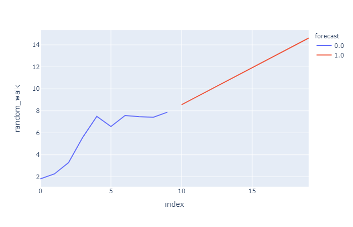
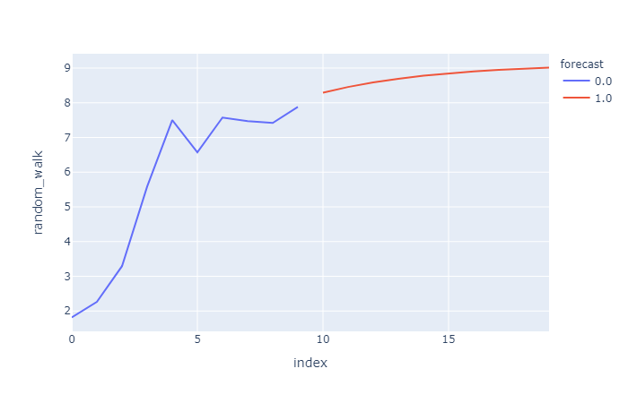

# Exponential Smoothing
###### For reference, read [Hyndman and Athanasopoulos' Chapter 7](https://otexts.com/fpp2/expsmooth.html)

---

# Non-parametrics, revisited

GAMs are great compromises between parametric and non-parametric modeling.

Today, let's talk about an assumption-free model

---

# Small-n, big problem

What happens to our previous models when we have a very small number of observations, and still need to make a forecast?

- What if you just have, like, two observations or something?

---

# A random walk, simulated

```python
import numpy as np
import plotly.express as px

np.random.seed(seed=0)

def step(prev=0):
    return prev + np.random.normal(loc=0.05, scale=1.0)

def walk(steps=10):
    data = []
    for i in range(10):
        if i==0:
            data.append(step())
        else:
            data.append(step(data[i-1]))
    return data
```
---

# Introducing...

Exponential Smoothing! A model that doesn't care what your data look like, or really how much you have!

---

# Simple Smoothing

Our first version of this model is super simple:
1) Take a weighted average of the data
2) Forecast that value!

---

# Simple Smoothing

How do we weight it? With $\alpha$!

$$ y_{t+1} = \alpha y_{t} + \alpha(1-\alpha) y_{t-1} + \alpha(1-\alpha)^2 y_{t-2} + ... $$

The weights on our model sum to ~1

---

# Simple Smoothing - The Code

```python
from statsmodels.tsa.api import ExponentialSmoothing, SimpleExpSmoothing
import pandas as pd

data = walk(10)

alpha020 = SimpleExpSmoothing(data).fit(
                                        smoothing_level=0.2,
                                        optimized=False)

alpha050 = SimpleExpSmoothing(data).fit(
                                        smoothing_level=0.5,
                                        optimized=False)

alpha080 = SimpleExpSmoothing(data).fit(
                                        smoothing_level=0.8,
                                        optimized=False)

level2 = alpha020.forecast(1)
level5 = alpha050.forecast(1)
level8 = alpha080.forecast(1)

print(level2, level5, level8)
```

---

# Simple Smoothing - The Code (#2)

```python
levels = pd.DataFrame([data, 
[float(level2) for i in range(10)], 
[float(level5) for i in range(10)], 
[float(level8) for i in range(10)]]).T

levels.columns = ['random_walk', 'alpha020', 'alpha050', 'alpha080']

px.line(levels, y=['random_walk', 'alpha020', 'alpha050', 'alpha080'])
```


---


---

# Solving problems!

Simple is good! The simplest model is to set $\alpha=1$, so that we only care what the most recent value is, and use it as our forecast.
- Has the added advantage of working with $n=1$!

We can also use an "unweighted" average.

---

# Not enough usefulness

So that's cool and simple, but what if I want a forward-looking forecast?

- Exponential smoothing can cover you!

---

# Smoothing plus Trendline

```python
# Linear trend
trend = ExponentialSmoothing(data, trend='add').fit()

trends = pd.DataFrame([data + list(trend.forecast(10)), [0]*10 + [1]*10]).T
trends.columns = ['random_walk', 'forecast']
                       
px.line(trends, y='random_walk', color='forecast')
```

---

# Smoothed Trends

Just like we could smooth past values, we can also create a smoothed trendline to include in our forecast!

---

# Damped Trends

```python
# Linear trend WITH DAMPING
trend = ExponentialSmoothing(data, trend='add', damped=True).fit()

trends = pd.DataFrame([data + list(trend.forecast(10)), [0]*10 + [1]*10]).T
trends.columns = ['random_walk', 'forecast']
                       
px.line(trends, y='random_walk', color='forecast')
```

---



---

# If present trends continue...

We know they never do, so we can dampen (weaken) the trend over time

---



---

# Seasonality? You got it!

Exponential Smoothing also allows for seasonality. While our current data doesn't have seasonal effects (it's a random walk), here is how we accomodate seasonality:

```python
# Linear trend with seasonality
trend = ExponentialSmoothing(employment, trend='add', seasonal='add').fit()
# Linear trend with damping and seasonality
dampedTrend = ExponentialSmoothing(employment, trend='add', seasonal='add', damped=True).fit()
```

---

# Lab Time!