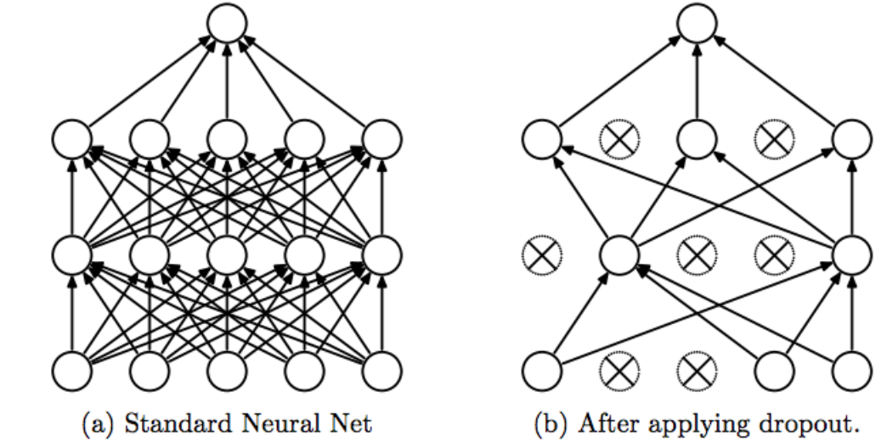

# From Convolutions to RNNs

---

# Whirlwind tour of modern neural network architectures

The most notable change in neural networks over time is the increased levels of abstraction that are used to design more complex models
- Design individual perceptrons (neurons)
- Design individual layers
- Design blocks of layers with specialized properties

---

# Convolution

---

# Convolution

The goal of convolution is to try to extract patterns in our image through small-scale filters applied to each region of the image. This reduces the size of the image, but the result is a matrix of "pattern" data.

---

# Pooling

---

# Pooling

Pooling is a simple compression of the data, with our options being to average the value of a group of pixels, or to take the maximum value of the grouped pixels

---

# Dropout

---

# Dropout

In a neural network, it is common for each neuron in one layer to connect to **every neuron in the next layer**. This is called a **fully connected** layer. In order to avoid overfitting, dropout "unplugs" a random percentage of neuron connections. The dropped connections are chosen randomly.

---

# Lab Time!