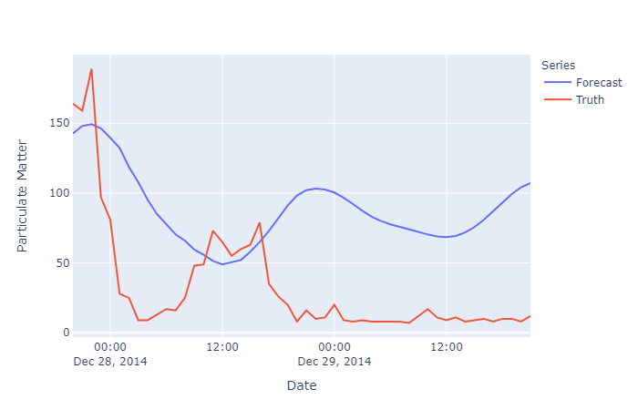
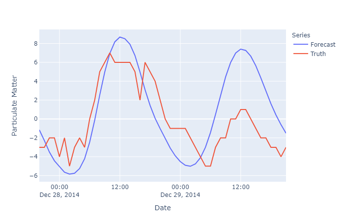
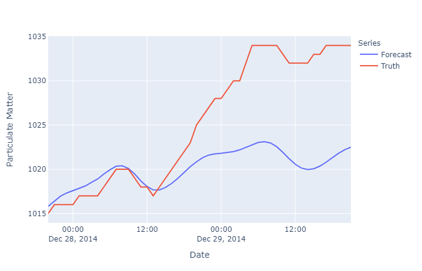
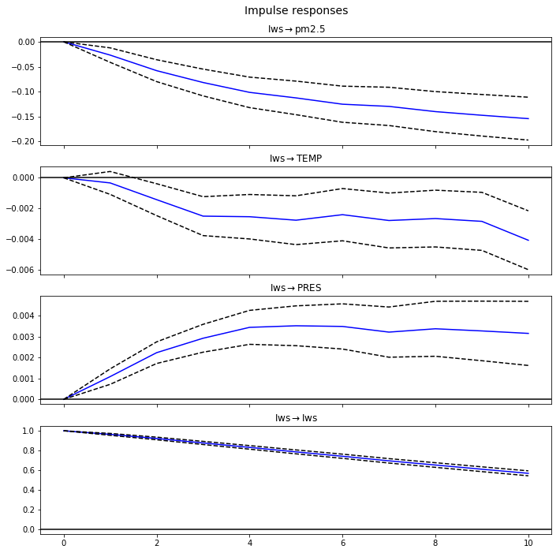
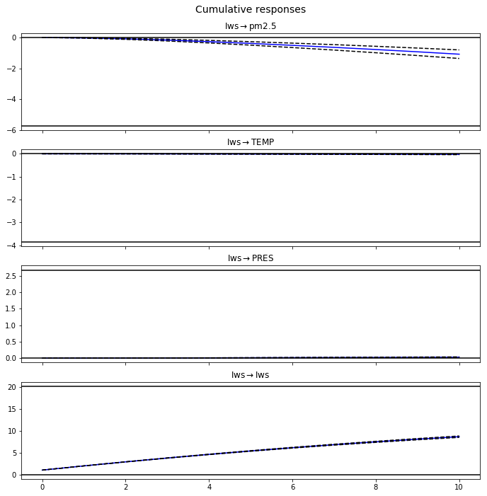

# Lecture 4: Time Series, VAR Models

---

# What is a VAR model?

VAR models are another way that we can model time series data.

- VAR: **V**ector **A**uto**R**egressive model
- Makes use of multiple correlated time series
- Based on SUR (Seemingly Unrelated Regressions) models

---

# Quick Overview of SUR models

<br>

Consider $j$ regression equations:

$$ Y_{j} = X_j\beta_j + \epsilon_j $$

where $Y_j$, and $\epsilon_j$ are $N \times 1$, $X_j$ is $N \times K$,  and $\beta_j$ is $K \times 1$


---

# Quick Overview of SUR models


Consider $j$ regression equations:

$$ Y_{j} = X_j\beta_j + \epsilon_j $$

Imagine that the outcomes $Y_{ij}$ are correlated such that 
$$ Cov(\epsilon_{ij}, \epsilon_{ik})=\sigma_{ij}$$
and 
$$ Cov(\epsilon_{ij}, \epsilon_{i'k})=0, \;\;\forall \;i \neq i'$$

---

# Quick Overview of SUR models

We can stack our $J$ regressions to get a single system of equations:

$$ \begin{bmatrix} Y_1 \\ Y_2 \\ \vdots \\ Y_{J}\end{bmatrix} = \begin{bmatrix} X & \mathbf{0} & ... & \mathbf{0}  \\ \mathbf{0} & X & ... & \mathbf{0}  \\ \vdots & \vdots & \ddots & \mathbf{0} \\ \mathbf{0} & \mathbf{0} & \mathbf{0} & X  \end{bmatrix} \begin{bmatrix} \beta_1 \\ \beta_2 \\ \vdots \\ \beta_{J\times K}\end{bmatrix} + \begin{bmatrix} \epsilon_1 \\ \epsilon_2 \\ \vdots \\ \epsilon_{J\times K}\end{bmatrix}$$

Where $Y_j$ is a vector of length $N$, and $X$ is an $N \times K$ matrix

---

# Quick Overview of SUR models

Then the FGLS estimator of the system is 

$$ \hat{\beta}_{FGLS} = \left( X'\left(\hat{\Sigma} \otimes I_J\right)X  \right)^{-1} X'\left(\hat{\Sigma} \otimes I_J\right)Y $$

<br>

Where $\hat{\Sigma} = [\hat{\sigma}_{ij}]$, and

$$ \hat{\sigma}_{ij} = \frac{1}{N}\left(y_i - X_i\beta_i\right)'\left(y_j - X_j\beta_j\right) $$


---

# Quick Overview of SUR models

So what does all this mean?
- SUR models relax the assumption that each regression is uncorrelated with the others
- Allows us to use some of our dependent variables in the $X$ matrices for other regressions
	- This will in turn allow us to model simultaneous time series, where the errors across the series will certainly be correlated


---

# VAR Models

Just a SUR model where the multiple dependent variables are time series
- We can include lags of dependent variables as part of the $X$ matrix of covariates
- VAR models are built to capture the interactions between variables as time passes

---

# VAR Models

<br>

We can write the VAR model

$$ \mathbf{y}_{i,t} = \mathbf{\mu_i} + \mathbf{\Gamma}_{i,1} \mathbf{y}_{i,t-1} + \sum_{j=1}^{J}\mathbf{\Gamma}_{j,1} \mathbf{y}_{i, t-1} + \mathbf{\epsilon}_{i,t} $$ 

where $i \neq j$

Representing the $i$th equation relating lagged dependent variables to the dependent variable in time $t$.

---

# Implementing a VAR Model

```python
# Getting started by importing modules and data
import pandas as pd, numpy as np
from statsmodels.tsa.api import VAR
import statsmodels.tsa.stattools as st
import plotly.express as px
from datetime import datetime

# Collect data, set index
# Be sure to put the URL back onto a single line!!
data = pd.read_csv("https://github.com/dustywhite7/Econ8310/
raw/master/DataSets/pollutionBeijing.csv")
# Difference and log dep. var.
format = '%Y-%m-%d %H:%M:%S'
data['datetime'] = pd.to_datetime(data['datetime'], 
	format=format)
data.set_index(pd.DatetimeIndex(data['datetime']), 
	inplace=True)
```

---


# Implementing a VAR Model

```python
# Select variables for VAR model
varData = data[['pm2.5','TEMP','PRES',
			'Iws']].dropna()[:-50]
```
<br>

- **REMEMBER: We need ALL stationary variables**
	- `st.adfuller` is the test to use on each variable
- We also need the terminal (or starting) values of each variable PRIOR to differencing to reconstruct the original time series

---


# Implementing a VAR Model

```python
model = VAR(varData) # define the model and data
model.select_order() # uses information criteria to
		     # select the model order
modelFit = model.fit(30) 
		# order chosen based on BIC criterion
```

- Diagnostics like those from the ARIMA(p,d,q) models are not available to determine our model order
- Use information criteria to find the optimal order of the VAR model
	- You could also do this with your ARIMA models if you so choose

---

# Forecasting with a VAR Model

```python
# Forecasting
pred = modelFit.forecast(varData['2013-01-04':].values, 
			steps = 50)
```

- When using a trained VAR model, we must include enough observations from our dataset in order to provide the expected number of lags to the model
- We have to begin our data **at least** $k$ observations prior to our end-point, where $k$ is the order of our model


---

# Forecasting with a VAR Model

Recall that our raw forecast is not always what we will observe in the real world
- If we have **differenced** our data, we need to undo that differencing
- THEN we apply our transformed forecasts to the most recent actual evaluation


<!-- ---

# Forecasting with a VAR Model

```python
def dediff(todaysVal, forecast):
    future = forecast
    for i in range(np.shape(forecast)[0]):
        if (i==0):
            future[i] = todaysVal + forecast[0]
        else:
            future[i] = future[i-1] + forecast[i]
            
    return future
```

- Use a function like this one to generate predicted values that can be applied to the original series (only if your data had to be differenced) -->


---

# Forecasting with a VAR Model

```python 
# Make predictions a DataFrame
nextPer = pd.DataFrame(pred,
                # Use the index from the last 50 observations
                #   as the index for the predictions
            	pd.DatetimeIndex(
                varData.iloc[-50:].index),
                columns=varData.columns)

# Isolate the testing data, last 50 periods
test = data.iloc[-50:]
```
<br>

Here, we transform our predictions (and truth) into datetime formatted values, so that we can more easily plot them.

---

# Forecasting with a VAR Model

```python 
# Create and format the figure
fig = px.line(x = nextPer.index, 
		y=[nextPer['pm2.5'], test['pm2.5']],
		labels = {
			'value' : 'Particulate Matter',
			'x' : 'Date',
			'variable' : 'Series'
		})

# Renaming the series
fig.data[0].name = "Forecast"
fig.data[1].name = "Truth"

# Render the plot
fig.show()
```

Plotting prediction vs truth

---


# Particulate Matter




---

# Temperature




---

# Air Pressure



---

# Wind Speed


---


# Forecasting Observations

<br>

- Repeated Forecasts are needed when data is updated
- Forecasts are not accurate far into the future


---

# Impulse Response Functions

<br>

- VAR Models can show us how each variable responds to a shock in our system
- Frequently used to determine impact of policy changes or economic shocks in Macro models
- Give us insight into how our VAR model perceives the relationship between parameters over time

---

# Impulse Response Functions

```python
irf = modelFit.irf(10) # 10-period Impulse Response Fn
irf.plot(impulse = 'Iws') # Plot volume change impact
irf.plot_cum_effects(impulse = 'Iws') # Plot effects
```

- Generate a 10-period Impulse Response Function (IRF)
- Focus on plotting the effect of changes in trade volume on all variables (over 10 periods)
- Plot the cumulative effect over 10 periods

---



---




<!-- 
---

# Saving Models

We can use ``` pickle``` functions to store our models to disk, and utilize them later.

```python
import cPickle as pkl

filename = 'myModel.pkl' #string of file name/location
output = open(filename, 'wb') # allow python to write
pkl.dump(modelFit, output) # stores the reg object @ filename
output.close() # terminate write process
```

In this way, we can store just about any object in Python, although we have to take care with how large some objects (or models) may be.

---

# Restoring Models

<br>

```python
reg = pkl.load(open('myModel.pkl', 'rb'))
```

When you are ready to access your model or data again, you can load your pickle back into memory.

- Forecast from same model on different days
- Share models with co-workers
- Just need to make sure to import libraries first! -->

---

# Lab Time!